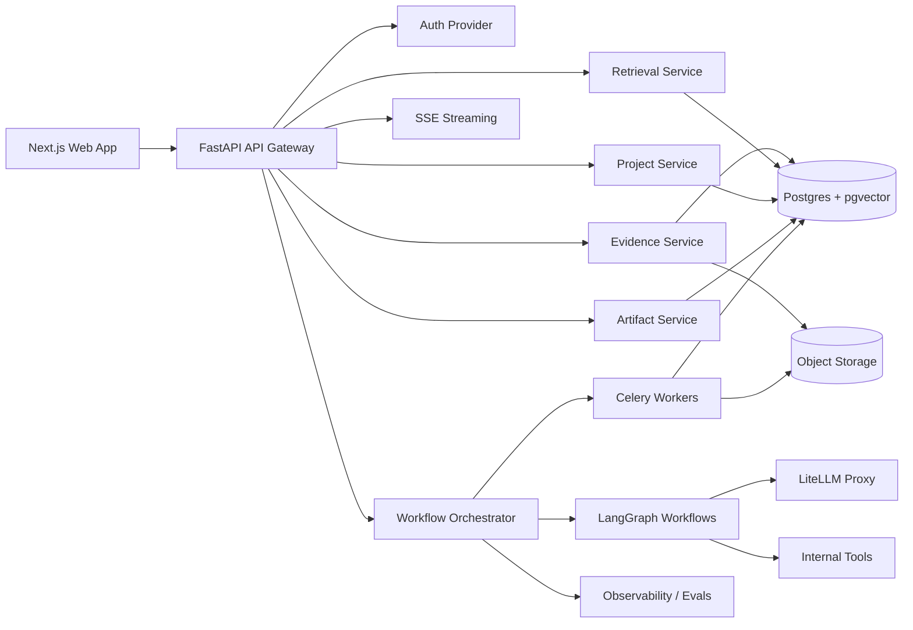

# Founder Strategic Intelligence OS — Product, Architecture, and Implementation Brief

**Working product name:** Founder Strategic Intelligence OS  
**Underlying platform thesis:** Strategic Intelligence Workflow Platform  
**Primary initial user:** solo founder / early-stage entrepreneur validating a business or product idea  
**Long-term user segments:** founders, product managers, consultants, venture studios, innovation teams, product marketing / competitive intelligence teams, and investors  
**Document purpose:** This document is intended to be fed into an AI coding agent such as Cursor, Claude Code, or a multi-agent engineering workflow. Treat it as the source-of-truth product and technical implementation brief.

---

## 0. Executive Summary

Build an AI-native strategic intelligence workspace that helps a founder turn a rough idea into an evolving, evidence-backed business thesis.

This is **not** a chatbot, business plan generator, pitch deck generator, or startup idea toy. The product should behave like a persistent operating system for ambiguous strategic work.

The MVP should let a user:

1. Create a project from a rough idea.
2. Convert that idea into structured strategic objects.
3. Generate an evidence-backed opportunity brief.
4. Analyze competitors and positioning.
5. Extract assumptions, risks, and validation experiments.
6. Add evidence over time.
7. Update the project thesis as evidence changes.
8. Record decisions and preserve why they were made.

The long-term product becomes a generalized **Strategic Intelligence Workflow Platform**. Founder OS is the first vertical workflow package. The same primitives later support product discovery, consultant research, corporate innovation, competitive intelligence, and diligence workflows.

The core product primitive is not chat. The core product primitive is the **project graph**:

> idea → thesis → segments → competitors → evidence → assumptions → experiments → decisions → artifacts → watchlists → alerts

A chat interface may exist, but it should be secondary. The workspace, memory, evidence graph, and workflow state are the product.

The MVP must include a production-grade RAG layer. Evidence-backed outputs should not be generated from prompts alone. The system must ingest project evidence, chunk it, embed it, retrieve relevant context, generate grounded artifacts, and attach citations to strategic claims.

The product should evolve from:

- **MVP:** grounded RAG for cited opportunity briefs, competitor analysis, assumption analysis, and evidence updates.
- **V1:** agentic RAG for multi-step research sprints where the system plans retrieval, calls retrieval tools, detects evidence gaps, performs iterative searches, critiques outputs, and updates project memory.
- **V2+:** multi-workflow strategic intelligence orchestration across founder, product, consultant, investor, and competitive-intelligence use cases.

---

## 1. Product Thesis

### 1.1 Problem

Founders, product builders, consultants, and operators use AI heavily for brainstorming and research, but the workflow remains fragmented across ChatGPT, Perplexity, Notion, Google Docs, spreadsheets, browser tabs, screenshots, and ad hoc notes.

Generic AI tools can answer questions, but they do not reliably maintain:

- persistent project memory
- structured assumptions
- evidence provenance
- decision history
- market-change monitoring
- versioned strategy evolution
- validation experiment loops
- repeatable strategic workflows

This creates a gap between **AI as a conversational assistant** and **AI as strategic operating infrastructure**.

### 1.2 Product Hypothesis

Users will pay for a system that does not merely generate strategic advice, but helps them maintain and evolve a strategic model over time.

The product wins if users think:

> “This system remembers my strategy, tracks my evidence, watches the market, and helps me make better decisions over time.”

### 1.3 Initial Wedge

Start with **Founder Strategic Intelligence OS** because founders have immediate pain, are easy to reach, tolerate early product roughness, and create naturally sharable outputs such as opportunity briefs, competitor teardowns, investor memos, and validation plans.

However, architect the system as a generalized strategic workflow engine from day one.

Founder OS is the first workflow pack, not the entire company.

### 1.4 Long-Term Category

The long-term category is:

> AI-native strategic intelligence workflows for ambiguous work.

Possible market-facing category names:

- Founder Intelligence Platform
- Strategic Intelligence OS
- Opportunity Intelligence Platform
- Product Discovery Intelligence OS
- Venture Validation OS
- AI-Native Strategy Workspace

Avoid weak positioning like:

- AI startup idea generator
- AI business plan writer
- ChatGPT for founders
- AI cofounder chatbot

Those sound commoditized.

---

## 2. Differentiation

### 2.1 What Existing Tools Commoditize

Generic assistants and AI research tools already commoditize:

- brainstorming
- first-draft research
- summarization
- business-plan drafting
- simple competitor lists
- document Q&A
- idea generation
- pitch deck outlines
- generic strategy advice

Do not try to compete on these alone.

### 2.2 Where Existing Tools Are Weak

Most tools are weak at:

- durable project state
- longitudinal reasoning
- structured evidence graphs
- assumption tracking
- decision traceability
- recurring monitoring
- workflow orchestration
- human-in-the-loop approval
- artifact versioning
- multi-project comparison
- connecting research to validation actions

### 2.3 MVP Differentiation

The MVP is differentiated if it combines the following in one coherent workflow:

1. **Structured strategic objects**  
   Store markets, segments, competitors, assumptions, risks, evidence, decisions, experiments, and artifacts as first-class records.

2. **Evidence-backed outputs**  
   Every factual claim in an opportunity brief should be grounded in source records whenever possible. Unsupported claims should be marked as inference or “needs validation.”

3. **Persistent project memory**  
   The system should remember how the idea, thesis, assumptions, and evidence evolve over time.

4. **Assumption-to-experiment loop**  
   The system should not stop at analysis. It should convert uncertain assumptions into validation experiments.

5. **Decision traceability**  
   Record what was decided, when, why, based on what evidence, and when to revisit it.

### 2.4 V1 Differentiation

V1 becomes a market separator when the system starts creating recurring value:

1. **Monitoring and watchlists**
   - competitor pricing changes
   - positioning changes
   - new entrant detection
   - launch/news/funding changes
   - hiring or technical signal changes
   - source-specific updates

2. **Research sprint workflows**
   - multi-step research
   - human approval
   - critique
   - evidence gap detection
   - final memo generation
   - project graph updates

3. **Customer discovery ingestion**
   - interview transcripts
   - notes
   - survey responses
   - pain clustering
   - ICP refinement
   - assumption confidence updates

4. **Multi-project portfolio comparison**
   - compare ideas side by side
   - rank by evidence strength, market attractiveness, risk, speed to MVP, and founder-market fit

5. **Collaboration**
   - comments
   - review states
   - approval gates
   - role-based workspace permissions

---

## 3. Non-Goals

For the MVP, do **not** build:

- a generic chatbot as the primary product
- a large autonomous multi-agent system
- an investor marketplace
- automatic company incorporation
- financial modeling-heavy business plans
- pitch deck generation as the main feature
- social networking features
- full CRM integration
- a mobile app first
- support for every possible user segment
- complex enterprise permissions beyond basic workspace roles
- proprietary market-data integrations
- automatic web crawling of the entire internet

The MVP should be narrow, high-quality, and stateful.

---

## 4. User Segments

### 4.1 Initial Segment: Founders

Primary users:

- solo founders
- indie hackers
- repeat founders
- technical founders
- early startup teams
- builders evaluating multiple product ideas

Primary jobs:

- evaluate an idea
- understand market viability
- identify competitors
- choose an initial customer segment
- uncover kill-risk assumptions
- design validation experiments
- synthesize customer discovery
- decide whether to build, pivot, pause, or kill

### 4.2 Later Segment: Product Managers

Primary jobs:

- synthesize customer feedback
- identify product opportunities
- generate evidence-backed opportunity briefs
- convert research into PRDs
- prioritize roadmap bets
- track assumptions behind product decisions

### 4.3 Later Segment: Consultants

Primary jobs:

- create market research memos
- produce competitor landscapes
- synthesize client documents
- generate client-ready strategic recommendations
- create source-backed deliverables quickly

### 4.4 Later Segment: Innovation Teams / Venture Studios

Primary jobs:

- intake many ideas
- normalize evaluation
- run stage-gate workflows
- compare opportunity portfolios
- track decisions and killed ideas
- monitor strategic bets over time

### 4.5 Later Segment: Competitive Intelligence / PMM

Primary jobs:

- monitor competitors
- update battlecards
- detect pricing, positioning, and feature changes
- push alerts into sales/product workflows

### 4.6 Later Segment: Investors

Primary jobs:

- evaluate startup opportunities
- generate diligence memos
- compare markets and competitors
- track risk registers
- monitor portfolio companies

---

## 5. Milestone Strategy

## 5.1 MVP: Single-Player Founder Workspace

### Purpose

Prove that a founder will use a stateful AI workspace to turn a rough idea into an evidence-backed, evolving project.

### What it proves

- AI workflows can create higher trust than generic chat.
- Structured memory creates more value than one-off generated reports.
- The user returns to the project to add evidence and refine assumptions.
- The architecture demonstrates serious AI systems engineering.
- The system can perform grounded generation using retrieval rather than relying on generic model knowledge.
- The project demonstrates core RAG capabilities expected in modern AI engineering roles: ingestion, chunking, embeddings, vector search, metadata filtering, citation grounding, and retrieval evaluation.

### MVP Features

| Feature | Status | Notes |
|---|---|---|
| User auth | Required | Basic individual auth. Workspace abstraction can exist but team features can wait. |
| Project creation | Required | Create project from rough idea. |
| Structured intake | Required | Convert natural language idea into typed project fields. |
| Clarifying questions | Required | Ask 3–7 useful questions when needed. |
| Opportunity brief generation | Required | Evidence-backed, versioned brief. |
| Evidence library | Required | Manual URLs, pasted notes, uploaded text/PDF docs. |
| Retrieval / RAG | Required | Use Postgres + pgvector for MVP. |
| Competitor analysis | Required | User-seeded competitor URLs plus limited discovery. |
| Assumption and risk extraction | Required | Rank by importance and uncertainty. |
| Validation plan generation | Required | Generate interview questions, experiments, success criteria. |
| Manual experiment result logging | Required | User enters outcomes; system updates confidence. |
| Decision log | Required | Record build/pivot/pause/kill decisions. |
| Artifact versioning | Required | At least version opportunity briefs. |
| Basic dashboard | Required | Thesis, confidence, next action, weak assumptions. |
| Chat | Optional | Secondary interaction layer only. |
| Watchlists | Optional / late MVP | Data model should exist; active monitoring can be V1. |

Additional MVP RAG requirements:

- Production-grade RAG pipeline:
  - ingest URLs, notes, uploaded docs, and manually entered evidence
  - chunk and embed source material
  - store source metadata in Postgres
  - store embeddings in pgvector
  - retrieve relevant evidence for strategic outputs
  - generate cited opportunity briefs, competitor analyses, assumption summaries, and thesis updates
  - preserve citations and source provenance

### MVP Success Criteria

A demo user can complete this path:

1. Sign up.
2. Create a project from a rough idea.
3. Answer clarifying questions.
4. Add 3–5 sources.
5. Generate an opportunity brief with citations.
6. Generate a competitor landscape.
7. Review top assumptions and risks.
8. Generate a validation plan.
9. Log validation results.
10. See thesis confidence and next recommended action update.
11. Record a decision.

### MVP Product Boundary

The MVP is done when the above flow works reliably for one founder and one project. Do not add more verticals before this is solid.

---

## 5.2 MVP+: Differentiated Single-Player Product

### Purpose

Make the MVP clearly feel unlike a generic AI wrapper.

### Additional Features

- stronger citation coverage
- source freshness metadata
- thesis version history
- evidence-to-assumption linking
- confidence deltas
- decision review dates
- exportable briefs
- basic watchlist configuration without fully automated intelligence
- quality/eval dashboard for generated artifacts
- basic cost tracking for LLM calls

### What it proves

- The product has a durable memory model.
- Outputs are inspectable.
- The user can revisit why strategy changed.
- The system is becoming infrastructure, not a one-off generator.

---

## 5.3 V1: Living Strategic Intelligence System

### Purpose

Create recurring value and make the product sticky.

### V1 Features

| Feature | Notes |
|---|---|
| Monitoring engine | Periodically check competitor/source watchlists. |
| Market-change alerts | “What changed, why it matters, what to do.” |
| Research sprint workflows | Multi-step, human-approved research workflows. |
| Human-in-the-loop checkpoints | Review plans, competitor sets, final memos. |
| Customer discovery ingestion | Upload interviews/notes/transcripts and map insights to assumptions. |
| Collaboration | Workspace roles, comments, mentions, approval states. |
| Multi-project dashboard | Compare several ideas by evidence strength, risk, and attractiveness. |
| Better exports | Markdown, PDF, Notion, Google Docs later. |
| Evaluation dashboard | Groundedness, citation coverage, retrieval quality, prompt regression tests. |
| Streaming workflow UI | Show long-running workflow progress. |
| Model routing | Use LiteLLM for cost-aware model selection, fallback, quotas. |

Additional V1 agentic RAG requirements:

- Agentic RAG research workflows:
  - decompose strategic questions into subquestions
  - choose retrieval strategies
  - call semantic search, keyword search, source-reading, and project-memory tools
  - perform iterative retrieval when evidence is insufficient
  - critique and revise generated conclusions
  - require human approval before updating major strategic objects
  - update project memory, assumptions, risks, decisions, and artifacts after approval

### What V1 proves

- The system becomes more valuable over time.
- It can monitor external changes and update project state.
- It can coordinate AI + humans + tools.
- It supports team decision-making.
- It is a serious AI workflow platform.
- The system can support agentic RAG, not just fixed retrieval chains.
- The product demonstrates durable, tool-using, human-in-the-loop AI workflows with persistent state and observable execution.

---

## 5.4 V2: Multi-Segment Strategic Workflow Platform

### Purpose

Expand beyond founders while reusing the same platform primitives.

### Segment Workflow Packs

| Workflow Pack | Primary User | Core Output |
|---|---|---|
| Founder Intelligence | Founders | Opportunity brief, validation plan, decision ledger |
| Product Discovery | PMs | Opportunity brief, PRD, prioritization memo |
| Consultant Research | Consultants | Client memo, competitor landscape, source appendix |
| Innovation Portfolio | Strategy teams | Stage-gate evaluation, portfolio dashboard |
| Competitive Intelligence | PMM / sales | Battlecards, change alerts |
| Diligence Copilot | Investors | Diligence memo, risk register |

### What V2 proves

- The underlying system is not founder-only.
- The product can package the same intelligence primitives for multiple high-value workflows.
- The platform supports templates, schemas, and workflows per segment.

---

## 5.5 V3: Enterprise / Platform Layer

### Purpose

Support serious teams and higher ACV customers.

### V3 Features

- SSO/SAML/SCIM
- organization-level permissions
- audit logs
- private connectors
- MCP tool ecosystem
- custom workflow builders
- custom ontologies
- enterprise data controls
- data retention controls
- workspace-level model policies
- usage quotas and billing
- mobile capture and review app
- Kubernetes deployment
- Temporal-based durable workflow engine for long-lived operational jobs

---

# 6. Core Product Objects

The app should model strategic work as structured data, not as chat transcripts.

## 6.1 Required Core Objects

| Object | Description |
|---|---|
| Project | A business/product/opportunity being explored. |
| Thesis | The current belief about why the idea should exist. Versioned over time. |
| Problem | The pain or job-to-be-done being addressed. |
| Customer Segment | A target user/buyer group. |
| Market | The category or market context. |
| Competitor | A direct competitor, adjacent tool, incumbent, or substitute. |
| Evidence Source | URL, file, note, transcript, or imported source. |
| Evidence Chunk | Parsed and embedded chunk used for retrieval. |
| Claim | A factual statement extracted or generated from evidence. |
| Assumption | A belief that must be true for the project to work. |
| Risk | A possible reason the project fails. |
| Experiment | A validation activity designed to test assumptions. |
| Experiment Result | User-entered or imported outcome of an experiment. |
| Decision | A recorded strategic decision with rationale and evidence links. |
| Artifact | Generated output such as brief, memo, plan, PRD, or teardown. |
| Artifact Version | Immutable snapshot of an artifact. |
| Watchlist | Sources/queries/entities to monitor over time. |
| Alert | A detected change that may affect the project. |
| AI Run | A record of an AI workflow execution. |
| AI Step | A record of one step inside an AI workflow. |
| Evaluation Result | Quality metrics for generated outputs and retrieval. |

## 6.2 Design Principle

Every important AI-generated output should write to structured records.

Do not store all useful content only as markdown blobs. Markdown artifacts are useful for display and export, but the system should also preserve the underlying structured objects.

---

# 7. MVP User Flows

## 7.1 MVP Flow 1: Vague Idea → Structured Opportunity Brief

### User Goal

A founder has a rough idea and wants to understand whether it is worth exploring.

### Flow

1. User creates a new project.
2. User enters a rough idea in natural language.
3. System asks 3–7 clarifying questions.
4. System converts answers into structured project fields:
   - target user
   - problem
   - proposed solution
   - market category
   - initial business model
   - suspected competitors
   - key uncertainties
5. System runs an opportunity brief workflow.
6. System generates an evidence-backed opportunity brief.
7. Brief is saved as version 1.
8. System extracts assumptions, risks, and next actions.

### Output

Opportunity Brief containing:

- idea summary
- target users
- problem hypothesis
- market context
- competitor landscape
- positioning options
- recommended wedge
- assumptions
- risks
- validation plan
- cited evidence
- confidence level
- next best action

### Differentiation

The system does not merely answer a question. It creates a structured, persistent project state that can evolve.

---

## 7.2 MVP Flow 2: Competitor Discovery → Positioning Map

### User Goal

Founder wants to understand who they are competing with and where they might differentiate.

### Flow

1. User clicks “Analyze Competition.”
2. System asks whether to:
   - discover competitors automatically,
   - analyze provided URLs,
   - include substitutes/manual alternatives.
3. User provides optional competitor URLs.
4. System extracts competitor details:
   - target user
   - pricing
   - positioning
   - features
   - integrations
   - GTM motion
   - strengths
   - weaknesses
5. System clusters competitors.
6. System generates positioning recommendations.
7. User marks competitors as primary, adjacent, irrelevant, or watchlist candidate.

### Output

Competitor Landscape containing:

- competitor profiles
- direct vs adjacent vs substitute categorization
- positioning map
- underserved areas
- wedge recommendations
- “where not to compete”
- citations/source links

### MVP Constraint

Keep this bounded. Do not attempt broad autonomous crawling. User-seeded URLs plus limited search/discovery are sufficient.

---

## 7.3 MVP Flow 3: Assumptions → Validation Plan

### User Goal

Founder wants to know what must be tested next.

### Flow

1. System extracts assumptions from the project:
   - problem urgency
   - buyer willingness to pay
   - reachable acquisition channel
   - technical feasibility
   - workflow frequency
   - differentiation strength
2. System ranks assumptions by:
   - importance
   - uncertainty
   - kill-risk
   - testability
3. User selects one or more assumptions.
4. System generates validation plans:
   - target respondent profile
   - interview questions
   - survey questions
   - outreach message
   - landing page concept
   - success criteria
   - expected signal strength
5. User manually logs validation results.
6. System updates confidence and recommends next action.

### Output

Validation Plan containing:

- assumption being tested
- method
- target audience
- step-by-step plan
- success metric
- failure threshold
- timeline
- follow-up decision rule

### Differentiation

This turns research into operational validation. The product tracks what must be true and how evidence changes confidence.

---

## 7.4 MVP Flow 4: Evidence Library → Updated Strategic Memo

### User Goal

Founder finds useful evidence over time and wants to know how it changes the thesis.

### Flow

1. User adds a URL, note, or file.
2. System ingests and classifies the evidence.
3. System links evidence to:
   - assumptions
   - risks
   - competitors
   - customer segments
   - project thesis
4. User asks “What does this change?”
5. System generates an update:
   - strengthened assumptions
   - weakened assumptions
   - new risks
   - updated recommendations
6. User accepts/rejects suggested updates.
7. System records a decision snapshot.

### Output

Evidence Update Summary containing:

- new evidence
- affected assumptions
- confidence changes
- thesis change recommendation
- citations/source links

### Differentiation

The product maintains a living evidence graph instead of a static document.

---

## 7.5 MVP Flow 5: Decision Log

### User Goal

Founder wants to preserve why they made a strategic choice.

### Flow

1. User selects “Record Decision.”
2. System suggests decision context based on current project state.
3. User chooses:
   - build
   - pivot
   - pause
   - kill
   - change ICP
   - change positioning
   - run validation first
4. User writes or accepts rationale.
5. System attaches relevant evidence, assumptions, and artifacts.
6. System sets optional review date.

### Output

Decision Record containing:

- decision
- rationale
- evidence links
- assumptions involved
- expected outcome
- review date
- author
- timestamp

### Differentiation

Most tools help generate decisions. This product helps remember and revisit them.

---

# 8. V1 User Flows

## 8.1 V1 Flow 1: Market Change → Strategy Revision

### User Goal

Founder wants the system to monitor changes and explain strategic implications.

### Flow

1. System monitors selected competitors, sources, and keywords.
2. System detects a meaningful change.
3. System generates alert:
   - what changed
   - why it matters
   - which assumptions are affected
   - recommended actions
4. User reviews alert.
5. User accepts strategy update or dismisses.
6. System updates project graph and decision log.

### Example Alert

“Competitor X changed pricing from $49/month to usage-based pricing and added automated onboarding. This overlaps with your proposed wedge for solo coaches. It increases differentiation risk for assumption A-12 and suggests testing a narrower ICP.”

---

## 8.2 V1 Flow 2: Research Sprint Workflow

### User Goal

Founder wants a deeper answer to a strategic question.

### Example Question

“Should I target independent fitness coaches, small gyms, or physical therapy clinics first?”

### Flow

1. User starts a Research Sprint.
2. System creates research plan.
3. User approves/edits plan.
4. System gathers/retrieves evidence.
5. System synthesizes segment comparison.
6. System critiques its own recommendation.
7. System identifies evidence gaps.
8. System produces final memo.
9. User records decision.
10. System creates follow-up experiments.

### Output

Segment Selection Memo containing:

- recommended ICP
- rejected segments
- evidence table
- confidence level
- key tradeoffs
- validation plan
- citations

---

## 8.3 V1 Flow 3: Customer Discovery Loop

### User Goal

Founder wants to synthesize interviews and update assumptions.

### Flow

1. User uploads interview notes/transcripts.
2. System extracts:
   - pains
   - current alternatives
   - buying triggers
   - objections
   - willingness-to-pay signals
   - customer language
3. System maps insights to assumptions.
4. System updates confidence scores.
5. System recommends ICP/messaging changes.
6. System generates next interview targets and questions.

### Output

Customer Discovery Summary containing:

- themes
- quotes/snippets
- segment clusters
- assumption updates
- messaging recommendations
- next interviews

---

## 8.4 V1 Flow 4: Team Decision Review

### User Goal

Small founding team wants to make and preserve a strategic decision.

### Flow

1. System generates decision memo.
2. Team members comment.
3. System identifies unresolved disagreements.
4. Team selects final decision.
5. System records rationale, evidence, and dissenting concerns.
6. System sets review date.
7. System later reminds team to revisit if results diverge.

---

## 8.5 V1 Flow 5: Multi-Idea Portfolio Comparison

### User Goal

Founder, studio, or consultant wants to compare several opportunities.

### Flow

1. User has multiple projects.
2. System scores each by:
   - pain severity
   - market accessibility
   - competitor intensity
   - founder-market fit
   - speed to MVP
   - willingness-to-pay evidence
   - technical defensibility
   - distribution feasibility
3. System shows portfolio dashboard.
4. User decides kill/pause/validate/proceed.
5. System records decision and archives or monitors ideas.

---

## 8.6 V1 Flow 6: Artifact Generation with Provenance

### User Goal

User wants a sharable memo, brief, or report.

### Flow

1. User selects artifact type:
   - investor memo
   - opportunity brief
   - validation brief
   - competitor teardown
   - GTM plan
   - customer discovery summary
2. System generates artifact using project memory.
3. Every factual claim links to evidence where possible.
4. User edits and approves.
5. System exports and versions artifact.

---

# 9. Adjacent Segment Flows

These are not MVP, but they define the long-term platform vision.

## 9.1 Product Discovery Intelligence OS

### Flow: Customer Feedback → Opportunity Brief → PRD

1. PM creates opportunity workspace.
2. System ingests support tickets, call notes, interviews, feature requests.
3. System clusters pain points.
4. System links feedback to personas, revenue, retention risk, and product area.
5. System generates opportunity brief.
6. PM selects opportunity.
7. System generates PRD, experiment plan, and success metrics.
8. System exports to Jira, Linear, Notion, or Productboard.

### Same Primitive, Different Frame

Founder OS asks: “Is this business worth building?”  
Product Discovery OS asks: “Is this product opportunity worth prioritizing?”

---

## 9.2 Consultant Research Operating System

### Flow: Client Question → Research Workspace → Executive Memo

1. Consultant creates client workspace.
2. Adds client brief, competitor URLs, market docs, notes.
3. System creates research plan.
4. Consultant approves scope.
5. System generates market landscape, competitor teardown, strategic options.
6. Consultant edits output.
7. System exports client-ready memo and source appendix.

### Requirements

- polished artifacts
- source appendices
- client workspaces
- reusable templates
- privacy controls

---

## 9.3 Innovation Team OS

### Flow: Internal Idea Intake → Stage-Gate Evaluation

1. Employees submit ideas through structured intake form.
2. System normalizes ideas into common schema.
3. System performs initial analysis.
4. Team reviews portfolio dashboard.
5. Ideas move through stages:
   - submitted
   - researched
   - validated
   - incubating
   - killed
   - launched
6. System tracks why ideas were killed or advanced.
7. Leadership receives portfolio intelligence.

---

## 9.4 VC / Angel Diligence Copilot

### Flow: Startup Target → Diligence Memo → Risk Register

1. Investor creates diligence workspace.
2. Uploads deck, website, notes, competitor list.
3. System generates company summary, market map, competitor analysis, GTM risk, technical risk.
4. System generates founder questions.
5. User records invest/pass decision.
6. System monitors portfolio or market updates.

---

## 9.5 Competitive Intelligence / GTM OS

### Flow: Competitor Change → Battlecard Update → Sales Enablement

1. Team creates competitor watchlists.
2. System monitors pricing pages, docs, changelogs, reviews, job postings.
3. System detects changes.
4. System classifies importance.
5. System updates battlecards.
6. PMM approves.
7. Sales receives updated talk tracks.

---

# 10. Technical Stack

Use this stack unless there is a strong reason to deviate.

## 10.1 Frontend

- **Next.js** with App Router
- **TypeScript**
- **Tailwind CSS**
- **shadcn/ui**
- **React Query / TanStack Query** for API state
- **SSE** for streaming workflow progress in MVP
- WebSockets later if bidirectional collaboration becomes important

## 10.2 Backend

- **FastAPI**
- **Python 3.11+**
- **Pydantic v2**
- **SQLAlchemy 2.0**
- **Alembic**
- **PostgreSQL**
- **pgvector**
- **Redis**
- **Celery** for async jobs in MVP
- **Temporal** later for long-lived durable workflows if needed

## 10.3 AI / LLM Layer

- **LiteLLM Proxy** as model gateway
  - model routing
  - fallback
  - spend tracking
  - virtual keys
  - per-workspace budgets later
- **LangGraph** for stateful workflows
  - structured intake
  - opportunity brief
  - competitor analysis
  - research sprint
  - human-in-the-loop review
- **LangChain** selectively
  - document loaders
  - retriever adapters
  - utility integrations
  - do not make LangChain the entire app architecture
- **OpenAI / Anthropic / Gemini-compatible models** behind LiteLLM
- **Structured JSON outputs** using Pydantic schemas

### RAG and Agentic RAG Strategy

The product should intentionally demonstrate both classic RAG and agentic RAG.

#### MVP: Grounded RAG

The MVP uses a deterministic, production-style RAG pipeline:

1. User creates or updates a project.
2. User adds evidence through URLs, notes, documents, or manual entries.
3. Evidence is normalized, chunked, embedded, and stored.
4. Strategic workflows retrieve relevant evidence before generation.
5. Outputs include citations linked to source records.
6. Claims that cannot be grounded should be marked as uncertain rather than presented confidently.

Use this for:

- opportunity brief generation
- competitor analysis
- assumption/risk analysis
- validation plan generation
- evidence update summaries
- thesis revision suggestions

#### V1: Agentic RAG

V1 introduces agentic RAG through LangGraph research workflows.

Agentic RAG is used when the user asks open-ended strategic questions that require planning, multiple retrieval passes, tool use, critique, and memory updates.

Example:

> “Should I target founders, product managers, or consultants first?”

The system should:

1. Clarify the decision.
2. Decompose the question into subquestions.
3. Retrieve from project memory.
4. Retrieve from the evidence library.
5. Search external sources if enabled.
6. Detect evidence gaps.
7. Run additional retrieval if needed.
8. Generate a cited recommendation.
9. Critique the recommendation.
10. Ask for human approval.
11. Update strategic objects after approval.

Do not call a workflow “agentic RAG” if it only performs a single retrieval step before generation.

## 10.4 Retrieval

MVP:

- Postgres + pgvector
- hybrid metadata + vector search
- user/project scoped retrieval
- source/chunk citation tracking

Later:

- Qdrant or Pinecone only if pgvector becomes limiting
- reranking
- source freshness scoring
- per-workspace indexing strategy

## 10.5 Observability / Evals

MVP:

- structured `ai_runs` and `ai_steps` tables
- request IDs and workflow IDs
- token/cost logging via LiteLLM
- basic latency/error metrics
- prompt/version logging

MVP+ / V1:

- Langfuse
- OpenTelemetry
- Phoenix, Ragas, or DeepEval
- golden eval datasets
- citation coverage
- groundedness checks
- retrieval precision checks
- regression tests for prompts/workflows

## 10.6 Auth

Recommended MVP:

- Clerk or Auth.js for web auth
- backend JWT verification
- `users`, `workspaces`, `workspace_members` in app DB
- workspace abstraction exists even if single-user in MVP

Security model:

- every record belongs to a workspace
- enforce workspace scoping in backend queries
- add Postgres row-level security later if needed
- never trust client-provided workspace IDs without membership check

## 10.7 Storage

- S3-compatible object storage
- Local dev: MinIO
- Production: S3, R2, or equivalent
- Store uploaded files in object storage
- Store parsed text and metadata in Postgres
- Store embeddings in pgvector

## 10.8 Deployment

MVP local:

- Docker Compose:
  - web
  - api
  - worker
  - postgres
  - redis
  - litellm
  - minio
  - langfuse optional

Production:

- Fly.io, Render, Railway, or ECS for early deployment
- Kubernetes later only when multi-service complexity justifies it
- CI/CD via GitHub Actions

---

# 11. High-Level Architecture



## 11.1 Service Responsibilities

### API Gateway / FastAPI

- auth enforcement
- workspace authorization
- REST endpoints
- SSE streaming
- job orchestration
- schema validation

### Project Service

- projects
- thesis versions
- customer segments
- problems
- markets
- dashboard summary

### Evidence Service

- source creation
- file upload
- URL ingestion
- parsing
- chunking
- embeddings
- source classification

### Retrieval Service

- scoped retrieval
- vector search
- metadata filters
- source snippets
- citation objects

### Workflow Orchestrator

- starts LangGraph workflows
- persists run state
- streams progress
- handles human approvals
- writes structured outputs to DB

### Artifact Service

- opportunity briefs
- competitor landscapes
- validation plans
- memos
- versioning
- exports later

### Assumption / Experiment Service

- assumption extraction
- risk extraction
- confidence updates
- validation plan generation
- experiment result logging

### Watchlist Service

MVP: data model only or lightweight manual configuration.  
V1: scheduled monitoring, diffing, alert generation.

---

# 12. Recommended Repository Structure

```text
strategic-intel-os/
  README.md
  PRODUCT_BRIEF.md
  IMPLEMENTATION_STATUS.md
  docker-compose.yml
  .env.example

  apps/
    web/
      package.json
      src/
        app/
        components/
        features/
          projects/
          evidence/
          competitors/
          assumptions/
          experiments/
          decisions/
          artifacts/
        lib/
        styles/

    api/
      pyproject.toml
      alembic.ini
      app/
        main.py
        core/
          config.py
          auth.py
          logging.py
          errors.py
        db/
          session.py
          models/
          migrations/
        schemas/
        routers/
          projects.py
          evidence.py
          workflows.py
          competitors.py
          assumptions.py
          experiments.py
          decisions.py
          artifacts.py
        services/
          project_service.py
          evidence_service.py
          retrieval_service.py
          workflow_service.py
          artifact_service.py
          assumption_service.py
          competitor_service.py
          decision_service.py
        ai/
          litellm_client.py
          prompts/
          schemas/
          graphs/
            structured_intake.py
            opportunity_brief.py
            competitor_analysis.py
            assumption_validation.py
            evidence_update.py
          tools/
            web_fetch.py
            source_retrieval.py
            citation_audit.py
        workers/
          celery_app.py
          tasks.py
        tests/

  infra/
    litellm/
      config.yaml
    postgres/
      init.sql
    minio/
    k8s/
      placeholder.md

  docs/
    architecture.md
    api.md
    data-model.md
    evals.md
    security.md
```

---

# 13. Data Model

Use UUID primary keys. Every table should include:

- `id`
- `workspace_id` where relevant
- `created_at`
- `updated_at`
- `created_by`
- soft-delete optional later

Below is a practical starting schema. The AI coding agent should implement this with SQLAlchemy and Alembic migrations.

## 13.1 Workspace and User Tables

```sql
users (
  id uuid primary key,
  external_auth_id text unique not null,
  email text not null,
  display_name text,
  created_at timestamptz not null
);

workspaces (
  id uuid primary key,
  name text not null,
  created_by uuid references users(id),
  created_at timestamptz not null
);

workspace_members (
  id uuid primary key,
  workspace_id uuid references workspaces(id),
  user_id uuid references users(id),
  role text not null check (role in ('owner','admin','member','viewer')),
  created_at timestamptz not null,
  unique(workspace_id, user_id)
);
```

## 13.2 Project Tables

```sql
projects (
  id uuid primary key,
  workspace_id uuid references workspaces(id),
  name text not null,
  short_description text,
  status text not null default 'active'
    check (status in ('active','paused','killed','launched','archived')),
  current_thesis_id uuid null,
  confidence_score numeric null,
  created_by uuid references users(id),
  created_at timestamptz not null,
  updated_at timestamptz not null
);

project_theses (
  id uuid primary key,
  workspace_id uuid references workspaces(id),
  project_id uuid references projects(id),
  version int not null,
  thesis_text text not null,
  rationale text,
  confidence_score numeric,
  created_by uuid references users(id),
  created_at timestamptz not null
);

customer_segments (
  id uuid primary key,
  workspace_id uuid references workspaces(id),
  project_id uuid references projects(id),
  name text not null,
  description text,
  buyer_type text,
  priority text check (priority in ('primary','secondary','rejected','unknown')),
  confidence_score numeric,
  created_at timestamptz not null,
  updated_at timestamptz not null
);

problems (
  id uuid primary key,
  workspace_id uuid references workspaces(id),
  project_id uuid references projects(id),
  segment_id uuid references customer_segments(id),
  description text not null,
  severity text check (severity in ('low','medium','high','critical','unknown')),
  frequency text,
  current_alternatives text,
  confidence_score numeric,
  created_at timestamptz not null,
  updated_at timestamptz not null
);
```

## 13.3 Evidence Tables

```sql
evidence_sources (
  id uuid primary key,
  workspace_id uuid references workspaces(id),
  project_id uuid references projects(id),
  source_type text not null
    check (source_type in ('url','file','note','transcript','manual')),
  title text,
  url text,
  object_storage_key text,
  raw_text text,
  summary text,
  source_date timestamptz,
  ingested_at timestamptz,
  classification text,
  credibility_score numeric,
  created_by uuid references users(id),
  created_at timestamptz not null,
  updated_at timestamptz not null
);

evidence_chunks (
  id uuid primary key,
  workspace_id uuid references workspaces(id),
  project_id uuid references projects(id),
  source_id uuid references evidence_sources(id),
  chunk_index int not null,
  text text not null,
  token_count int,
  embedding vector(1536), -- adjust dimension to embedding model
  metadata jsonb not null default '{}',
  created_at timestamptz not null
);

claims (
  id uuid primary key,
  workspace_id uuid references workspaces(id),
  project_id uuid references projects(id),
  text text not null,
  claim_type text,
  confidence_score numeric,
  support_level text check (support_level in ('supported','partial','unsupported','inference')),
  created_at timestamptz not null
);

claim_evidence_links (
  id uuid primary key,
  claim_id uuid references claims(id),
  evidence_source_id uuid references evidence_sources(id),
  evidence_chunk_id uuid references evidence_chunks(id),
  relevance_score numeric,
  quote text,
  created_at timestamptz not null
);
```

## 13.4 Competitor Tables

```sql
competitors (
  id uuid primary key,
  workspace_id uuid references workspaces(id),
  project_id uuid references projects(id),
  name text not null,
  url text,
  category text check (category in ('direct','adjacent','incumbent','substitute','manual_alternative','unknown')),
  target_user text,
  positioning text,
  pricing_summary text,
  strengths text,
  weaknesses text,
  differentiation_notes text,
  threat_level text check (threat_level in ('low','medium','high','unknown')),
  watchlist_status text default 'not_watched',
  created_at timestamptz not null,
  updated_at timestamptz not null
);

competitor_evidence_links (
  id uuid primary key,
  competitor_id uuid references competitors(id),
  evidence_source_id uuid references evidence_sources(id),
  evidence_chunk_id uuid references evidence_chunks(id),
  created_at timestamptz not null
);
```

## 13.5 Assumption, Risk, Experiment Tables

```sql
assumptions (
  id uuid primary key,
  workspace_id uuid references workspaces(id),
  project_id uuid references projects(id),
  text text not null,
  category text,
  importance text check (importance in ('low','medium','high','critical')),
  uncertainty text check (uncertainty in ('low','medium','high')),
  kill_risk boolean default false,
  confidence_score numeric,
  status text default 'untested'
    check (status in ('untested','testing','validated','invalidated','inconclusive')),
  created_at timestamptz not null,
  updated_at timestamptz not null
);

risks (
  id uuid primary key,
  workspace_id uuid references workspaces(id),
  project_id uuid references projects(id),
  text text not null,
  category text,
  severity text check (severity in ('low','medium','high','critical')),
  likelihood text check (likelihood in ('low','medium','high','unknown')),
  mitigation text,
  status text default 'open'
    check (status in ('open','mitigated','accepted','closed')),
  created_at timestamptz not null,
  updated_at timestamptz not null
);

experiments (
  id uuid primary key,
  workspace_id uuid references workspaces(id),
  project_id uuid references projects(id),
  assumption_id uuid references assumptions(id),
  name text not null,
  method text,
  plan text,
  success_criteria text,
  failure_threshold text,
  status text default 'planned'
    check (status in ('planned','running','completed','cancelled')),
  created_at timestamptz not null,
  updated_at timestamptz not null
);

experiment_results (
  id uuid primary key,
  workspace_id uuid references workspaces(id),
  project_id uuid references projects(id),
  experiment_id uuid references experiments(id),
  result_summary text not null,
  outcome text check (outcome in ('positive','negative','mixed','inconclusive')),
  confidence_delta numeric,
  raw_notes text,
  created_by uuid references users(id),
  created_at timestamptz not null
);
```

## 13.6 Decision and Artifact Tables

```sql
decisions (
  id uuid primary key,
  workspace_id uuid references workspaces(id),
  project_id uuid references projects(id),
  decision_type text
    check (decision_type in ('build','pivot','pause','kill','change_icp','change_positioning','run_experiment','other')),
  title text not null,
  rationale text,
  expected_outcome text,
  review_date date,
  created_by uuid references users(id),
  created_at timestamptz not null
);

decision_links (
  id uuid primary key,
  decision_id uuid references decisions(id),
  linked_type text not null, -- evidence, assumption, risk, artifact, competitor
  linked_id uuid not null,
  created_at timestamptz not null
);

artifacts (
  id uuid primary key,
  workspace_id uuid references workspaces(id),
  project_id uuid references projects(id),
  artifact_type text not null
    check (artifact_type in ('opportunity_brief','competitor_landscape','validation_plan','decision_memo','research_memo','customer_discovery_summary','other')),
  title text not null,
  current_version_id uuid null,
  created_by uuid references users(id),
  created_at timestamptz not null,
  updated_at timestamptz not null
);

artifact_versions (
  id uuid primary key,
  workspace_id uuid references workspaces(id),
  artifact_id uuid references artifacts(id),
  version int not null,
  markdown_content text not null,
  structured_content jsonb not null default '{}',
  generated_by_ai_run_id uuid null,
  created_by uuid references users(id),
  created_at timestamptz not null
);
```

## 13.7 Watchlist Tables for V1

Implement schema in MVP if easy, but UI/workflows can wait.

```sql
watchlists (
  id uuid primary key,
  workspace_id uuid references workspaces(id),
  project_id uuid references projects(id),
  name text not null,
  status text default 'active'
    check (status in ('active','paused','archived')),
  created_at timestamptz not null,
  updated_at timestamptz not null
);

watchlist_sources (
  id uuid primary key,
  workspace_id uuid references workspaces(id),
  watchlist_id uuid references watchlists(id),
  source_type text check (source_type in ('url','keyword','competitor','rss','manual')),
  url text,
  keyword text,
  competitor_id uuid references competitors(id),
  last_checked_at timestamptz,
  last_hash text,
  created_at timestamptz not null
);

alerts (
  id uuid primary key,
  workspace_id uuid references workspaces(id),
  project_id uuid references projects(id),
  watchlist_id uuid references watchlists(id),
  title text not null,
  summary text not null,
  importance text check (importance in ('low','medium','high','critical')),
  status text default 'new'
    check (status in ('new','reviewed','dismissed','acted_on')),
  affected_assumption_ids uuid[] default '{}',
  affected_competitor_ids uuid[] default '{}',
  evidence_source_id uuid references evidence_sources(id),
  created_at timestamptz not null
);
```

## 13.8 AI Observability Tables

```sql
ai_runs (
  id uuid primary key,
  workspace_id uuid references workspaces(id),
  project_id uuid references projects(id),
  workflow_type text not null,
  status text not null check (status in ('queued','running','succeeded','failed','cancelled','waiting_for_human')),
  model_provider text,
  model_name text,
  prompt_version text,
  input_summary text,
  output_summary text,
  total_tokens int,
  total_cost numeric,
  error text,
  started_at timestamptz,
  completed_at timestamptz,
  created_by uuid references users(id),
  created_at timestamptz not null
);

ai_steps (
  id uuid primary key,
  ai_run_id uuid references ai_runs(id),
  step_name text not null,
  status text not null,
  input_json jsonb,
  output_json jsonb,
  latency_ms int,
  tokens int,
  cost numeric,
  error text,
  created_at timestamptz not null
);

eval_results (
  id uuid primary key,
  workspace_id uuid references workspaces(id),
  ai_run_id uuid references ai_runs(id),
  eval_type text not null,
  score numeric,
  details jsonb,
  created_at timestamptz not null
);
```

---

# 14. API Design

Use REST for MVP. Add GraphQL only if needed later.

## 14.1 Projects

```http
GET    /api/projects
POST   /api/projects
GET    /api/projects/{project_id}
PATCH  /api/projects/{project_id}
DELETE /api/projects/{project_id}
```

## 14.2 Structured Intake

```http
POST /api/projects/{project_id}/intake/analyze
POST /api/projects/{project_id}/intake/answer
POST /api/projects/{project_id}/intake/finalize
```

## 14.3 Evidence

```http
GET    /api/projects/{project_id}/evidence
POST   /api/projects/{project_id}/evidence/url
POST   /api/projects/{project_id}/evidence/file
POST   /api/projects/{project_id}/evidence/note
GET    /api/projects/{project_id}/evidence/{source_id}
DELETE /api/projects/{project_id}/evidence/{source_id}
POST   /api/projects/{project_id}/evidence/{source_id}/reprocess
```

## 14.4 Artifacts

```http
GET  /api/projects/{project_id}/artifacts
POST /api/projects/{project_id}/artifacts/opportunity-brief/generate
POST /api/projects/{project_id}/artifacts/competitor-landscape/generate
GET  /api/projects/{project_id}/artifacts/{artifact_id}
GET  /api/projects/{project_id}/artifacts/{artifact_id}/versions
POST /api/projects/{project_id}/artifacts/{artifact_id}/export
```

## 14.5 Competitors

```http
GET  /api/projects/{project_id}/competitors
POST /api/projects/{project_id}/competitors
POST /api/projects/{project_id}/competitors/analyze
PATCH /api/projects/{project_id}/competitors/{competitor_id}
```

## 14.6 Assumptions, Risks, Experiments

```http
GET  /api/projects/{project_id}/assumptions
POST /api/projects/{project_id}/assumptions/extract
PATCH /api/projects/{project_id}/assumptions/{assumption_id}

GET  /api/projects/{project_id}/risks
POST /api/projects/{project_id}/risks/extract

GET  /api/projects/{project_id}/experiments
POST /api/projects/{project_id}/experiments/validation-plan
POST /api/projects/{project_id}/experiments/{experiment_id}/results
```

## 14.7 Decisions

```http
GET  /api/projects/{project_id}/decisions
POST /api/projects/{project_id}/decisions
GET  /api/projects/{project_id}/decisions/{decision_id}
```

## 14.8 Workflows

```http
POST /api/projects/{project_id}/workflows/{workflow_type}/start
GET  /api/workflows/{run_id}
GET  /api/workflows/{run_id}/events     # SSE stream
POST /api/workflows/{run_id}/approve
POST /api/workflows/{run_id}/cancel
```

Workflow types:

- `structured_intake`
- `opportunity_brief`
- `competitor_analysis`
- `assumption_extraction`
- `validation_plan`
- `evidence_update`
- `research_sprint` later
- `watchlist_monitor` later

---

# 15. AI Workflow Design

Use LangGraph for multi-step stateful workflows. Keep workflows deterministic enough to resume and inspect.

## 15.1 General Workflow Rules

- All AI workflows must create an `ai_runs` row.
- Each node/step must create an `ai_steps` row.
- Use typed Pydantic input/output schemas.
- Persist structured results to application tables.
- Do not rely on chat transcript as state.
- Every factual output should attempt citation grounding.
- Unsupported factual claims should be marked as inference or “needs validation.”
- Human approval is required before major project state changes in V1. For MVP, user can accept/reject suggested updates.

## 15.2 Workflow: Structured Intake

### Purpose

Convert vague idea into structured project state.

### Inputs

- raw idea text
- optional user background
- optional target market guess
- optional constraints

### Nodes

1. `load_project_context`
2. `analyze_idea`
3. `detect_missing_fields`
4. `generate_clarifying_questions`
5. `apply_user_answers`
6. `create_structured_project_summary`
7. `write_project_fields`

### Output Schema

```python
class StructuredProjectIntake(BaseModel):
    project_name: str
    one_sentence_summary: str
    target_users: list[str]
    buyer_type: Literal["consumer", "prosumer", "smb", "midmarket", "enterprise", "unknown"]
    problem_hypotheses: list[str]
    proposed_solution: str
    market_category: str | None
    business_model_guess: str | None
    suspected_competitors: list[str]
    key_uncertainties: list[str]
    clarifying_questions: list[str]
```

## 15.3 Workflow: Opportunity Brief

### Purpose

Generate a source-grounded strategic memo and structured records.

### Nodes

1. `load_project_state`
2. `retrieve_existing_evidence`
3. `identify_research_gaps`
4. `gather_or_prompt_for_sources`
5. `extract_relevant_claims`
6. `synthesize_market_context`
7. `synthesize_customer_segments`
8. `synthesize_competition`
9. `extract_assumptions_and_risks`
10. `generate_recommended_wedge`
11. `citation_audit`
12. `generate_markdown_brief`
13. `write_artifact_version`
14. `write_assumptions_risks_claims`

### Output Schema

```python
class OpportunityBrief(BaseModel):
    executive_summary: str
    target_users: list[str]
    problem_statement: str
    current_alternatives: list[str]
    market_context: str
    competitor_summary: str
    positioning_options: list[str]
    recommended_wedge: str
    assumptions: list["AssumptionDraft"]
    risks: list["RiskDraft"]
    validation_plan_summary: str
    confidence_score: float
    citations: list["Citation"]
    unsupported_claims: list[str]
```

## 15.4 Workflow: Competitor Analysis

### Purpose

Create competitor profiles and positioning recommendations.

### Nodes

1. `load_project_state`
2. `load_user_seeded_competitors`
3. `discover_limited_competitors`
4. `fetch_competitor_sources`
5. `extract_competitor_profiles`
6. `cluster_competitors`
7. `identify_positioning_gaps`
8. `write_competitor_records`
9. `generate_competitor_landscape_artifact`

### Output Schema

```python
class CompetitorProfileDraft(BaseModel):
    name: str
    url: str | None
    category: Literal["direct", "adjacent", "incumbent", "substitute", "manual_alternative", "unknown"]
    target_user: str | None
    positioning: str | None
    pricing_summary: str | None
    key_features: list[str]
    strengths: list[str]
    weaknesses: list[str]
    threat_level: Literal["low", "medium", "high", "unknown"]
    citations: list["Citation"]
```

## 15.5 Workflow: Assumption Extraction and Validation Plan

### Purpose

Convert strategy into testable assumptions.

### Nodes

1. `load_project_state`
2. `extract_assumptions`
3. `rank_assumptions`
4. `generate_risks`
5. `generate_validation_plan`
6. `write_assumptions_risks_experiments`

### Output Schema

```python
class AssumptionDraft(BaseModel):
    text: str
    category: str
    importance: Literal["low", "medium", "high", "critical"]
    uncertainty: Literal["low", "medium", "high"]
    kill_risk: bool
    confidence_score: float
    recommended_test: str

class ValidationPlanDraft(BaseModel):
    assumption_text: str
    method: str
    target_respondent: str
    steps: list[str]
    interview_questions: list[str]
    survey_questions: list[str]
    success_criteria: str
    failure_threshold: str
    expected_signal_strength: Literal["weak", "medium", "strong"]
```

## 15.6 Workflow: Evidence Update

### Purpose

Determine how new evidence changes project state.

### Nodes

1. `load_new_evidence`
2. `retrieve_related_project_state`
3. `classify_evidence`
4. `link_evidence_to_assumptions`
5. `estimate_confidence_deltas`
6. `suggest_thesis_update`
7. `user_accepts_or_rejects`
8. `write_updates`

### Output Schema

```python
class EvidenceUpdateSummary(BaseModel):
    source_id: str
    classification: str
    summary: str
    affected_assumptions: list[str]
    strengthened_assumptions: list[str]
    weakened_assumptions: list[str]
    new_risks: list[str]
    thesis_update_recommendation: str | None
    confidence_deltas: dict[str, float]
    citations: list["Citation"]
```

## 15.7 MVP Workflow: Grounded RAG Generation

### Purpose

Generate strategic outputs using retrieved project evidence rather than generic model knowledge.

### Used By

- Opportunity Brief workflow
- Competitor Analysis workflow
- Assumption Extraction workflow
- Evidence Update workflow
- Thesis Update workflow

### Inputs

- project_id
- user_query or workflow objective
- artifact_type
- source_filters
- max_sources
- required_citation_policy

### Nodes

1. **Query Builder**
   - Convert the workflow objective into one or more retrieval queries.
   - Include project context, target segment, competitors, and relevant assumptions.

2. **Retriever**
   - Run semantic search against pgvector.
   - Run keyword search against source titles, snippets, and extracted text.
   - Apply metadata filters for project, source type, competitor, assumption, and freshness.

3. **Reranker / Evidence Selector**
   - Select the most relevant chunks.
   - Remove duplicates.
   - Prefer recent, primary, and high-signal sources.
   - Return evidence bundles with source IDs.

4. **Grounded Generator**
   - Generate the requested artifact using only the selected evidence plus project state.
   - Attach citations to factual claims.
   - Mark unsupported claims as assumptions or open questions.

5. **Citation Validator**
   - Verify that citations reference actual retrieved chunks.
   - Reject or flag generated claims without evidence.

6. **Artifact Writer**
   - Save the generated output.
   - Save cited claims.
   - Link claims to evidence records.

### Output Schema

```json
{
  "artifact_id": "uuid",
  "artifact_type": "opportunity_brief",
  "summary": "string",
  "claims": [
    {
      "claim": "string",
      "source_ids": ["uuid"],
      "confidence": "low | medium | high"
    }
  ],
  "unsupported_assumptions": ["string"],
  "follow_up_questions": ["string"]
}
```

### Acceptance Criteria

- Every factual claim in generated strategic artifacts has at least one citation or is explicitly marked as an assumption.
- Retrieval results are visible in traces.
- The system stores source IDs, chunk IDs, artifact IDs, and claim IDs.
- The same project query can be rerun and compared against prior output.

## 15.8 V1 Workflow: Research Sprint / Agentic RAG

### Purpose

Run a bounded, inspectable research workflow for a strategic question.

### Nodes

1. `scope_question`
2. `propose_research_plan`
3. `human_approval_interrupt`
4. `retrieve_internal_context`
5. `gather_external_sources`
6. `extract_findings`
7. `synthesize_answer`
8. `critic_review`
9. `identify_evidence_gaps`
10. `finalize_memo`
11. `human_publish_approval`
12. `write_artifacts_and_state_updates`

Additional agentic RAG nodes:

1. **Research Planner**
   - Break the user’s strategic question into subquestions.
   - Decide what evidence is needed.

2. **Retrieval Strategy Selector**
   - Choose semantic search, keyword search, source reading, competitor lookup, project-memory lookup, or external search.

3. **Tool Executor**
   - Calls retrieval and source-reading tools.
   - Keeps tool usage scoped to the current project and tenant.

4. **Gap Detector**
   - Determines whether there is enough evidence to answer.
   - If not, loops back to retrieval with refined queries.

5. **Critic**
   - Challenges the draft answer.
   - Identifies weak claims, unsupported conclusions, and missing counterarguments.

6. **Human Approval**
   - Requires the user to approve major updates before changing the thesis, assumptions, decisions, or recommendations.

7. **Memory Writer**
   - Writes approved updates into project state.
   - Links new conclusions to evidence and decisions.

---

# 16. Retrieval and Citation Design

The retrieval layer is a first-class product capability and portfolio requirement. The MVP should implement classic RAG. V1 should extend this into agentic RAG through LangGraph workflows.

The RAG system must support:

- source ingestion
- chunking
- embeddings
- metadata extraction
- vector search
- keyword search
- hybrid retrieval
- reranking or evidence selection
- citation generation
- citation validation
- retrieval evals
- observability traces

## 16.1 Ingestion

Supported MVP source types:

- manual notes
- URLs
- uploaded PDFs
- uploaded text/markdown files
- pasted interview notes

Later:

- Google Docs
- Notion
- Slack
- Linear/Jira
- Gong/Zoom transcripts
- app store reviews
- RSS feeds
- web search APIs
- MCP connectors

## 16.2 Pipeline

1. Create `evidence_sources` row.
2. Fetch or upload raw content.
3. Parse content.
4. Normalize text.
5. Generate source summary.
6. Classify source.
7. Chunk text.
8. Embed chunks.
9. Store chunks in `evidence_chunks`.
10. Link chunks to project/workspace.
11. Use chunks for retrieval and citations.

## 16.3 Chunking Defaults

- target chunk size: 800–1,200 tokens
- overlap: 100–200 tokens
- preserve headings
- store source URL/title/date
- store `chunk_index`
- store content hash for deduplication

## 16.4 Retrieval Defaults

MVP retrieval query should include:

- workspace filter
- project filter
- source type filters when relevant
- vector similarity
- keyword fallback or hybrid search
- top_k default 8–15 chunks
- optional reranking later

Retrieval modes:

1. **Semantic Search**
   - Use embeddings for conceptual similarity.

2. **Keyword Search**
   - Use Postgres full-text search or equivalent search over titles, snippets, and extracted text.

3. **Hybrid Search**
   - Combine semantic and keyword results.
   - Prefer hybrid search for opportunity briefs and competitor analysis.

4. **Metadata-Filtered Search**
   - Filter by project_id, workspace_id, source_type, competitor_id, assumption_id, created_at, and freshness.

5. **Agentic Retrieval**
   - V1 only.
   - A LangGraph workflow chooses which retrieval tools to call based on the research question.

## 16.5 Citation Object

```python
class Citation(BaseModel):
    source_id: str
    chunk_id: str | None
    title: str | None
    url: str | None
    quote: str | None
    retrieved_at: datetime
    relevance_score: float | None
```

## 16.6 Citation Rules

- Every factual market/competitor claim in generated artifacts should cite at least one source when available.
- If no source supports a claim, label it as:
  - inference
  - hypothesis
  - needs validation
- Never fabricate citations.
- Keep citations attached to structured claims, not just markdown text.

## 16.7 RAG Evaluation Requirements

The MVP should include basic retrieval and grounding evaluation.

Track:

- retrieval precision@k
- citation coverage
- number of unsupported factual claims
- source freshness
- duplicate source rate
- artifact groundedness score
- user correction rate
- retrieval latency
- cost per generated artifact

Minimum eval dataset:

- 10 opportunity brief questions
- 10 competitor analysis questions
- 10 assumption/risk questions
- 10 evidence update questions

Each eval case should include:

- project fixture
- evidence fixture
- expected relevant source IDs
- expected output characteristics
- unacceptable hallucinations

The eval harness should run in CI or as a local command.

---

# 17. Frontend UX

## 17.1 App Navigation

Primary pages:

```text
/dashboard
/projects
/projects/new
/projects/[projectId]
/projects/[projectId]/brief
/projects/[projectId]/evidence
/projects/[projectId]/competitors
/projects/[projectId]/assumptions
/projects/[projectId]/experiments
/projects/[projectId]/decisions
/projects/[projectId]/monitor       # V1
/settings
```

## 17.2 Project Workspace Tabs

The project page should have these tabs:

1. **Overview**
   - current thesis
   - confidence score
   - next best action
   - top risks
   - top assumptions
   - recent changes

2. **Brief**
   - current opportunity brief
   - version history
   - citations
   - regenerate/update button

3. **Evidence**
   - source list
   - upload/add URL/add note
   - classification
   - linked assumptions/claims

4. **Competitors**
   - competitor profiles
   - categories
   - threat level
   - positioning notes
   - watchlist status later

5. **Assumptions**
   - ranked assumptions
   - confidence
   - importance
   - uncertainty
   - status

6. **Experiments**
   - validation plans
   - experiment status
   - result logging
   - confidence deltas

7. **Decisions**
   - decision ledger
   - rationale
   - evidence links
   - review dates

8. **Monitor** later
   - watchlists
   - alerts
   - changes

## 17.3 First-Use Wizard

The initial project creation experience should guide the user:

1. Enter rough idea.
2. Answer clarifying questions.
3. Add optional sources/competitors.
4. Generate first opportunity brief.
5. Review assumptions.
6. Pick first validation experiment.

## 17.4 UX Principle

The user should always see:

- what the system knows
- what it believes
- what evidence supports it
- what is uncertain
- what to do next

---

# 18. Implementation Roadmap for AI Coding Agents

This section is intentionally concrete. Implement in order. Do not skip vertical slices.

## Sprint 0: Repository and Local Dev Foundation

### Goals

- Set up monorepo.
- Set up Docker Compose.
- Set up API/web skeletons.
- Set up database migrations.

### Tasks

1. Create repository structure.
2. Add `docker-compose.yml` with:
   - postgres with pgvector
   - redis
   - minio
   - litellm
   - api
   - web
3. Add `.env.example`.
4. Scaffold FastAPI app.
5. Scaffold Next.js app.
6. Add Alembic.
7. Add base SQLAlchemy models.
8. Add healthcheck endpoints.
9. Add README with local setup.

### Acceptance Criteria

- `docker compose up` starts all local services.
- API healthcheck works.
- Web app loads.
- Alembic can run migrations.
- pgvector extension is enabled.

---

## Sprint 1: Auth, Workspaces, Projects

### Goals

- User can sign in.
- User can create and view projects.
- Workspace scoping exists.

### Tasks

1. Implement auth provider integration.
2. Add backend JWT verification.
3. Create users/workspaces/workspace_members tables.
4. Create projects and project_theses tables.
5. Implement project CRUD API.
6. Build project list UI.
7. Build new project UI.
8. Build project overview page.

### Acceptance Criteria

- Authenticated user can create a project.
- User only sees their workspace projects.
- Project overview displays empty states for brief, evidence, assumptions, competitors.

---

## Sprint 2: LiteLLM and AI Run Infrastructure

### Goals

- All LLM calls go through LiteLLM.
- AI runs are logged.
- Structured JSON generation works.

### Tasks

1. Add LiteLLM config.
2. Implement `litellm_client.py`.
3. Implement AI run/step tables.
4. Implement structured output helper using Pydantic schemas.
5. Add prompt versioning convention.
6. Add cost/token logging where available.
7. Add test LLM stub for local/dev.

### Acceptance Criteria

- Backend can call LLM through LiteLLM.
- AI run and step are logged.
- A test endpoint can return structured JSON.
- If no API key exists, dev stub returns deterministic fake data.

---

## Sprint 3: Structured Intake Workflow

### Goals

- User enters rough idea.
- System creates structured project state.
- System asks clarifying questions when necessary.

### Tasks

1. Implement structured intake Pydantic schema.
2. Implement LangGraph workflow.
3. Add `/intake/analyze`, `/intake/answer`, `/intake/finalize`.
4. Store first thesis version.
5. Create customer segments/problems from structured output.
6. Build frontend intake wizard.

### Acceptance Criteria

- User can enter vague idea.
- System asks useful clarifying questions.
- System saves structured project summary.
- Project overview updates with thesis and next steps.

---

## Sprint 4: Evidence Ingestion and Retrieval

### Goals

- User can add sources.
- System parses, chunks, embeds, retrieves, and cites evidence.
- Build the MVP RAG foundation.

### Tasks

1. Implement evidence source and chunk tables.
2. Add URL ingestion.
3. Add manual note ingestion.
4. Add PDF/text upload.
5. Add object storage integration.
6. Add parser/chunker.
7. Add embedding generation.
8. Store embeddings in pgvector.
9. Implement scoped retrieval API.
10. Implement document chunking.
11. Implement embedding generation.
12. Store embeddings in pgvector.
13. Implement semantic search.
14. Implement keyword search.
15. Implement hybrid retrieval.
16. Add metadata filters for project, source type, competitor, assumption, and freshness.
17. Return retrieval results with source IDs and chunk IDs.
18. Build Evidence tab.

### Acceptance Criteria

- User can add URL/note/file.
- Sources appear in Evidence tab.
- Chunks are embedded.
- Retrieval returns relevant chunks scoped to project.
- Sources have summaries and classifications.
- A user can add evidence and retrieve relevant chunks through an API.
- Retrieval supports semantic search, keyword search, and hybrid search.
- Retrieval results include source metadata and chunk references.
- Retrieval calls are traced through the AI observability layer.

---

## Sprint 5: Opportunity Brief Generation

### Goals

- Generate a useful source-grounded opportunity brief.
- Generate the opportunity brief using grounded RAG.

### Tasks

1. Implement opportunity brief workflow.
2. Retrieve relevant evidence.
3. Generate structured opportunity brief.
4. Generate markdown artifact.
5. Run citation audit.
6. Retrieve relevant evidence before generating the brief.
7. Require citations for factual claims.
8. Store cited claims separately from unsupported assumptions.
9. Add citation validation before saving the artifact.
10. Save artifact and version.
11. Display brief with citations.
12. Extract assumptions and risks from brief.

### Acceptance Criteria

- User can click “Generate Brief.”
- Brief appears with citations.
- Brief is versioned.
- Assumptions and risks are created.
- Unsupported claims are marked.
- Opportunity briefs are generated from retrieved evidence.
- Every factual claim includes a citation or is marked as an assumption.
- The artifact links back to source records and chunk records.

---

## Sprint 6: Competitor Analysis

### Goals

- User can create competitor landscape.

### Tasks

1. Add competitor tables.
2. Add manual competitor URL input.
3. Implement competitor source ingestion.
4. Implement competitor profile extraction.
5. Implement competitor clustering.
6. Generate competitor landscape artifact.
7. Build Competitors tab.

### Acceptance Criteria

- User can add competitor URLs.
- System creates profiles.
- Competitors are categorized.
- System recommends positioning gaps.
- Competitor landscape is saved as artifact.

---

## Sprint 7: Assumptions, Experiments, Decisions

### Goals

- User can turn assumptions into validation plans and record decisions.

### Tasks

1. Build Assumptions tab.
2. Build Risks display.
3. Implement validation plan generation.
4. Build Experiments tab.
5. Add manual result logging.
6. Update assumption confidence based on results.
7. Build Decisions tab.
8. Allow decision records linked to assumptions/evidence/artifacts.

### Acceptance Criteria

- Assumptions are ranked by importance/uncertainty.
- User can generate validation plan.
- User can log experiment result.
- Confidence score changes.
- User can record decision with rationale and links.

---

## Sprint 8: MVP Polish and Demo

### Goals

- Make the end-to-end product demo coherent.

### Tasks

1. Add loading/progress states.
2. Add SSE workflow updates.
3. Add error handling.
4. Add empty states.
5. Add basic eval checks.
6. Add seed/demo project.
7. Add README demo script.
8. Add screenshots or walkthrough GIF later.

### Acceptance Criteria

- A new user can complete the full MVP flow.
- Demo project showcases evidence-backed brief, competitors, assumptions, experiments, and decisions.
- System feels like a strategic workspace, not a chatbot.

---

## Sprint 9: Live ML Demo Readiness

### Goals

- Run the MVP workflows against real LLM calls instead of deterministic stubs.
- Make live/stub AI mode visible and debuggable.
- Verify the product can complete the core demo path with real model outputs.
- Preserve deterministic stub mode for local development and tests.

### Tasks

1. Add an AI status endpoint:
   - report `LLM_STUB_MODE`
   - report configured `LITELLM_MODEL`
   - report LiteLLM base URL reachability
   - report whether provider keys are present without exposing secret values
   - optionally run a small structured-output healthcheck
2. Add a visible AI mode indicator in the web UI:
   - show `Stub mode` when deterministic responses are enabled
   - show `Live LLM` when calls go through LiteLLM
   - show model name and last healthcheck status
3. Update `.env.example` with a clearly documented live-demo configuration block:
   - `LLM_STUB_MODE=never`
   - `OPENAI_API_KEY=...`
   - `LITELLM_MODEL=dev-gpt-4o-mini`
   - `LITELLM_API_KEY=sk-local-dev`
   - `LITELLM_MASTER_KEY=sk-local-dev`
4. Add live-demo setup instructions to `README.md`.
5. Verify LiteLLM with the existing structured-output smoke test:
   - `POST /api/ai/test-structured-output`
   - confirm `used_stub=false`
   - confirm `model_provider=litellm`
6. Run live LLM workflows end to end:
   - structured intake
   - opportunity brief generation
   - competitor analysis
   - assumption extraction
   - validation-plan generation
7. Improve live-mode error handling:
   - surface LiteLLM/provider errors in the UI
   - keep workflow traces readable when an LLM step fails
   - avoid silent fallback to stub when `LLM_STUB_MODE=never`
8. Add cost and token visibility to workflow trace where available.
9. Decide whether Sprint 9 includes real embeddings:
   - minimum milestone can keep deterministic hash embeddings
   - stronger milestone should add provider-backed embeddings and model config
10. Add tests for AI status and live/stub mode configuration behavior.

### Live Demo Instructions

1. Add provider credentials to `.env`:

   ```bash
   LLM_STUB_MODE=never
   OPENAI_API_KEY=<real key>
   LITELLM_MODEL=dev-gpt-4o-mini
   LITELLM_API_KEY=sk-local-dev
   LITELLM_MASTER_KEY=sk-local-dev
   ```

2. Restart LiteLLM and API:

   ```bash
   docker compose restart litellm api
   ```

3. Run the structured-output smoke test:

   ```bash
   curl -X POST http://localhost:8000/api/ai/test-structured-output \
     -H "Content-Type: application/json" \
     -d '{"idea":"AI workspace for independent fitness coaches"}'
   ```

4. Confirm the response includes:

   ```json
   {
     "used_stub": false,
     "model_provider": "litellm"
   }
   ```

5. In the web UI, create or open a project and run:
   - Analyze Idea
   - Add evidence
   - Generate Brief
   - Analyze Competitors
   - Extract Assumptions
   - Generate Plans

6. Inspect workflow traces for:
   - successful step completion
   - model name
   - token usage when available
   - cost when available
   - readable errors if the provider fails

### Acceptance Criteria

- The app can run with `LLM_STUB_MODE=never`.
- Structured-output smoke test succeeds through LiteLLM.
- Web UI clearly indicates whether the app is using stub mode or live LLM mode.
- Core demo workflows complete with `used_stub=false`.
- Failed provider calls produce actionable UI and workflow trace errors.
- Existing deterministic tests still pass with stub mode forced on.
- README contains a repeatable live-demo setup path.

Yep — the issue was the nested code fences. Here’s the corrected version wrapped in a **four-backtick Markdown fence**, so the inner triple-backtick code blocks won’t break it.

````md
## Sprint 10: Guided Strategic Overview and MVP Activation Flow

### Purpose

The MVP currently has the right underlying product primitives: projects, structured intake, opportunity briefs, evidence, competitors, assumptions, experiments, decisions, RAG, and workflow execution.

However, the user experience must make the value obvious.

This sprint converts the MVP from a technical project dashboard into a guided strategic validation workflow.

The Overview page should answer:

1. What is the current recommendation?
2. What stage is this idea in?
3. How ready is this idea for validation?
4. What is missing?
5. What should the user do next?
6. Why does the next step matter?
7. What changed recently?

The goal is that a founder can open a project and immediately understand the state of the idea and the next action to take.

---

### Core Product Principle

The MVP should help a user go from:

> Rough idea → structured thesis → evidence-backed brief → assumptions → validation plan → decision

The user should never wonder:

> “What am I supposed to do now?”

Every project should expose:

- current stage
- current recommendation
- next best action
- readiness state
- missing items
- strategic snapshot
- evidence health
- recent strategic updates

---

### MVP User Promise

The MVP should support this promise:

> Go from rough idea to evidence-backed validation plan.

This sprint should prioritize clarity, guidance, and activation over adding new AI workflows.

Do not build V1 features during this sprint. Do not add monitoring, collaboration, multi-project portfolio views, or advanced agentic research sprints yet.

---

## Project Lifecycle State Machine

Add or compute a project lifecycle stage.

### Supported MVP Stages

```ts
type ProjectStage =
  | "draft_idea"
  | "structured_intake"
  | "brief_generated"
  | "competitors_analyzed"
  | "assumptions_identified"
  | "validation_plan_created"
  | "experiment_running"
  | "decision_ready"
  | "paused"
  | "killed"
  | "proceeding";
```

### Stage Definitions

| Stage | Meaning | Primary CTA |
|---|---|---|
| `draft_idea` | User has entered only a rough idea | Structure Idea |
| `structured_intake` | Idea has been clarified into structured fields | Generate Opportunity Brief |
| `brief_generated` | Opportunity brief exists | Analyze Competitors |
| `competitors_analyzed` | Competitor analysis exists | Review Assumptions |
| `assumptions_identified` | Assumptions and risks exist | Create Validation Plan |
| `validation_plan_created` | Validation plan exists | Start Experiment |
| `experiment_running` | User is collecting validation evidence | Add Results |
| `decision_ready` | There is enough evidence to make a decision | Record Decision |
| `paused` | User paused the idea | Resume or Archive |
| `killed` | User killed the idea | View Decision |
| `proceeding` | User decided to continue | Plan Next Milestone |

### Acceptance Criteria

- Every project has a current stage.
- The stage can be derived from existing project data when possible.
- The stage determines the primary CTA.
- The Overview page clearly displays the current stage.
- The stage updates when major workflows complete.

---

## Overview Page Redesign

Update the Overview page to show these sections in this order:

1. Current Recommendation
2. Next Best Action
3. Idea Readiness
4. Strategic Snapshot
5. Evidence Health
6. Recent Strategic Updates
7. Key Assumptions / Risks

Existing tabs can remain:

- Overview
- Brief
- Evidence
- Competitors
- Assumptions
- Experiments
- Decisions

But the Overview tab should become the guided command center for the project.

---

## 1. Current Recommendation Card

### Purpose

The user should immediately understand the system’s current opinion about the idea.

This should be more useful than simply showing the current thesis.

### Required Fields

```ts
type StrategicRecommendation = {
  id: string;
  project_id: string;
  recommendation: string;
  rationale: string;
  confidence: "low" | "medium" | "high";
  next_action_type: string;
  next_action_label: string;
  source_artifact_ids: string[];
  source_evidence_ids: string[];
  created_at: string;
};
```

### Example

```text
Current Recommendation

Narrow the idea before validating.

This idea is currently too broad as a general plant education platform. The strongest initial wedge appears to be personalized plant-care guidance for beginner houseplant owners.

Confidence: Medium-Low

Next step:
Choose a primary customer segment.
```

### Rules

- If there is insufficient evidence, say so directly.
- Do not overstate confidence.
- Recommendation should be actionable.
- Recommendation should update after major workflows complete.
- Recommendation should be grounded in project state, artifacts, evidence, assumptions, and decisions.

### Acceptance Criteria

- Every project displays a current recommendation.
- Recommendation is understandable to a non-technical founder.
- Recommendation includes a rationale.
- Recommendation includes confidence.
- Recommendation includes a next step.
- Recommendation does not read like generic AI advice.

---

## 2. Next Best Action Card

### Purpose

The user should always know the next thing to do.

### Required Fields

```ts
type NextBestAction = {
  action_type: string;
  label: string;
  description: string;
  why_it_matters: string;
  primary: boolean;
  related_stage: ProjectStage;
  target_route?: string;
};
```

### CTA Mapping

| Stage | Primary CTA | Why |
|---|---|---|
| `draft_idea` | Structure Idea | Turn rough idea into usable strategic inputs |
| `structured_intake` | Generate Opportunity Brief | Create first evidence-backed view of opportunity |
| `brief_generated` | Analyze Competitors | Understand substitutes and positioning gaps |
| `competitors_analyzed` | Review Assumptions | Identify what must be true for the idea to work |
| `assumptions_identified` | Create Validation Plan | Convert risk into concrete tests |
| `validation_plan_created` | Start Experiment | Begin reducing uncertainty |
| `experiment_running` | Add Results | Update confidence based on real-world evidence |
| `decision_ready` | Record Decision | Capture whether to proceed, pivot, pause, or kill |

### Example

```text
Next Best Action

Choose your first customer segment.

Why:
Your idea currently mixes plant education, plant care, and social events. These may be different businesses.

Recommended options:
1. Beginner plant owners
2. Plant hobbyists
3. Local nurseries
4. Apartment renters

[Choose Segment]
```

### Acceptance Criteria

- User sees exactly one primary recommended action.
- User may see up to two secondary actions.
- Button labels are outcome-oriented.
- Avoid unclear labels like “Apply Answers” or “Finalize Intake.”
- Every action explains why it matters.

---

## 3. Idea Readiness Card

### Purpose

Replace developer-facing MVP readiness with founder-facing idea readiness.

The user does not need to know how many backend checks passed. The user needs to know whether the idea is ready to validate.

### Required Fields

```ts
type IdeaReadiness = {
  project_id: string;
  score: number;
  status:
    | "not_ready"
    | "partially_ready"
    | "ready_for_validation"
    | "decision_ready";
  completed_items: ReadinessItem[];
  missing_items: ReadinessItem[];
  weakest_area: string;
  recommended_next_action: string;
};

type ReadinessItem = {
  key: string;
  label: string;
  status: "complete" | "missing" | "needs_work";
  related_action?: string;
};
```

### Readiness Dimensions

Track these readiness dimensions:

1. rough idea exists
2. thesis exists
3. target customer is specific
4. problem hypothesis exists
5. evidence sources exist
6. competitors analyzed
7. assumptions identified
8. high-risk assumptions ranked
9. validation plan exists
10. decision recorded

### Example

```text
Idea Readiness: 55%

Status:
Not ready for validation.

Complete:
✓ Rough idea
✓ Initial thesis
✓ Opportunity brief

Missing:
○ Specific target customer
○ Competitor comparison
○ Willingness-to-pay evidence
○ Validation experiment

Weakest area:
Willingness to pay

Recommended next action:
Create a validation experiment.
```

### Acceptance Criteria

- Rename “MVP Readiness” to “Idea Readiness.”
- Do not show “checks passed” language.
- Missing items are tied to actions.
- Readiness updates as workflows complete.
- Readiness is useful to a founder, not just a developer.

---

## 4. Strategic Snapshot Card

### Purpose

Give the user a compact view of the current strategic state.

### Required Fields

```ts
type StrategicSnapshot = {
  current_thesis?: string;
  target_user?: string;
  primary_problem?: string;
  proposed_wedge?: string;
  main_risk?: string;
  current_confidence: "low" | "medium" | "high";
  current_stage: ProjectStage;
};
```

### Example

```text
Strategic Snapshot

Current Thesis:
Plant Parenthood helps beginner plant owners keep houseplants alive through personalized care guidance and simple troubleshooting.

Target User:
Not selected yet.

Primary Problem:
Plant-care information is fragmented and hard to apply to a specific home environment.

Main Risk:
Users may not pay because free plant-care content and existing care-reminder apps already exist.

Current Stage:
Structured Intake
```

### Acceptance Criteria

- Snapshot is generated from structured project state.
- Missing fields are explicitly shown as missing.
- User can click missing fields to resolve them.
- Snapshot should not be a long generated essay.

---

## 5. Evidence Health Card

### Purpose

Show whether the idea is grounded in evidence or still mostly assumption.

### Required Fields

```ts
type EvidenceHealth = {
  source_count: number;
  competitor_count: number;
  cited_claim_count: number;
  unsupported_claim_count: number;
  validated_assumption_count: number;
  weakest_evidence_area: string;
  last_evidence_update?: string;
};
```

### Example

```text
Evidence Health

Sources: 4
Competitors: 3
Cited claims: 12
Unsupported claims: 5
Validated assumptions: 0

Weakest area:
Willingness to pay
```

### Acceptance Criteria

- Evidence health is derived from actual stored evidence, artifact, claim, competitor, and assumption data.
- Unsupported claims are visible.
- User can navigate from this card to Evidence or Assumptions.
- The card should reinforce that the product is evidence-backed, not just AI-generated.

---

## 6. Recent Strategic Updates

### Purpose

Replace technical workflow logs with user-facing strategic updates.

Users should not primarily see:

```text
evidence ingestion succeeded
competitor analysis succeeded
```

They should see what changed and why it matters.

### Required Fields

```ts
type StrategicUpdate = {
  id: string;
  project_id: string;
  title: string;
  summary: string;
  why_it_matters: string;
  related_entity_type:
    | "artifact"
    | "evidence"
    | "competitor"
    | "assumption"
    | "experiment"
    | "decision"
    | "workflow";
  related_entity_id: string;
  created_at: string;
};
```

### Examples

```text
Competitor analysis completed
3 direct competitors found. Existing apps mostly focus on reminders and plant identification.

Why it matters:
This weakens a generic education-only thesis and suggests personalization or local/community learning may be better wedges.
```

```text
Evidence added
2 sources strengthened the beginner-care pain hypothesis.

Why it matters:
The problem appears real, but willingness to pay remains unvalidated.
```

```text
Assumption created
“Users will pay for personalized plant care” was added as a high-risk assumption.

Why it matters:
This is likely the most important validation risk before building.
```

### Acceptance Criteria

- Rename “Recent Workflows” to “Recent Strategic Updates.”
- Workflow records are translated into human-readable updates.
- Updates explain why the event matters.
- Users can click updates to view related artifacts, evidence, assumptions, competitors, experiments, or decisions.
- Backend workflow status can still exist, but it should not be the primary user-facing language.

---

## 7. Guided Empty States

### Purpose

Every tab should teach the user what the section is for and what to do next.

No tab should feel like an empty database table.

### Evidence Empty State

```text
No evidence yet.

Evidence is what keeps this from becoming generic AI advice. Add competitor pages, customer notes, market research, app reviews, Reddit threads, or interview notes.

[Add Evidence]
```

### Assumptions Empty State

```text
No assumptions identified yet.

Assumptions are the beliefs that must be true for this idea to work. The system will help you rank them by risk and turn them into validation experiments.

[Extract Assumptions]
```

### Experiments Empty State

```text
No validation experiments yet.

Experiments help you reduce uncertainty before building. Start by testing the riskiest assumption.

[Create Validation Plan]
```

### Competitors Empty State

```text
No competitors analyzed yet.

Competitor analysis helps identify substitutes, crowded areas, positioning gaps, and potential wedges.

[Analyze Competitors]
```

### Decisions Empty State

```text
No decisions recorded yet.

Decisions capture what you chose, why you chose it, what evidence supported it, and when to revisit it.

[Record Decision]
```

### Acceptance Criteria

- Every tab has a guided empty state.
- Every empty state explains what the section is for.
- Every empty state explains why it matters.
- Every empty state has a clear CTA.

---

## API Requirements

Add or update the following endpoints.

### Get Overview

```http
GET /projects/{project_id}/overview
```

Returns:

```json
{
  "project": {},
  "current_recommendation": {},
  "next_best_action": {},
  "idea_readiness": {},
  "strategic_snapshot": {},
  "evidence_health": {},
  "recent_strategic_updates": [],
  "key_assumptions": [],
  "key_risks": []
}
```

### Get Readiness

```http
GET /projects/{project_id}/readiness
```

Returns user-facing idea readiness.

### Get Strategic Updates

```http
GET /projects/{project_id}/strategic-updates
```

Returns recent strategic updates.

### Execute Next Action

```http
POST /projects/{project_id}/next-action
```

Starts or routes to the recommended next action.

---

## Frontend Requirements

### Hero Section

The project hero should show:

- project name
- short description
- current stage badge
- optional system health badge, but visually secondary

The LLM health badge should not dominate the user experience.

### Overview Layout

Use this layout:

1. Current Recommendation
2. Next Best Action
3. Idea Readiness
4. Strategic Snapshot
5. Evidence Health
6. Recent Strategic Updates
7. Key Assumptions / Risks

### Button Label Changes

Replace implementation-oriented labels.

| Current Label | Better Label |
|---|---|
| Analyze Idea | Structure Idea or Generate Opportunity Brief |
| Apply Answers | Save Structured Thesis |
| Finalize Intake | Generate Opportunity Brief |
| Recent Workflows | Recent Strategic Updates |
| MVP Readiness | Idea Readiness |
| Checks Passed | Ready / Missing / Needs Work |

### Acceptance Criteria

- A first-time user can understand what the product does from the Overview page alone.
- A user always knows the next recommended action.
- The Overview page explains what is missing before the idea is ready to validate.
- Backend workflow events are translated into strategic updates.
- The product feels like a strategic advisor with evidence, not a dashboard of AI workflows.

---

## Backend Implementation Notes

Prefer computed objects first where possible.

Do not overcomplicate this sprint with unnecessary persistence if existing project data can support computed responses.

Recommended approach:

1. Add project `stage` if it does not exist.
2. Add a backend service that computes:
   - current recommendation
   - next best action
   - idea readiness
   - strategic snapshot
   - evidence health
3. Add strategic updates using workflow outputs and existing entities.
4. Persist strategic recommendations only if useful for history/versioning.
5. Keep workflow execution unchanged unless needed for better strategic updates.

### Suggested Service Names

```text
ProjectOverviewService
IdeaReadinessService
NextBestActionService
StrategicRecommendationService
StrategicUpdateService
EvidenceHealthService
```

---

## Non-Goals

Do not build these in this sprint:

- V1 monitoring engine
- recurring watchlists
- multi-user collaboration
- multi-project portfolio dashboard
- investor workflows
- consultant workflows
- product discovery workflows
- advanced agentic research sprint
- mobile app
- billing
- team workspaces

This sprint is about MVP clarity and activation.

---

## Final Acceptance Criteria

This sprint is complete when:

- The Overview page no longer feels like a developer dashboard.
- “MVP Readiness” has been replaced by user-facing “Idea Readiness.”
- “Recent Workflows” has been replaced by “Recent Strategic Updates.”
- Every project has a visible current stage.
- Every project has a current recommendation.
- Every project has one primary next best action.
- The user can understand what is missing before validation.
- The user can understand why the next action matters.
- Empty states teach the workflow.
- Button labels are outcome-oriented.
- The app clearly supports the promise: rough idea → evidence-backed validation plan.
````

---

# Updated V1 and V2 Roadmap

## Strategic Shift

The product direction has been refined.

The original V1 plan was too broad. It included research workflows, monitoring, collaboration, exports, persistent memory, and platform features all at once.

The updated V1 should focus on the first major product “wow” moment:

> A user gives the app a rough idea, and the system investigates the market, discovers competitors, gathers evidence, synthesizes a cited research memo, identifies assumptions, and recommends what to validate next.

V1 is no longer primarily about making the workspace more complete.

V1 is about making the app feel alive.

---

# Phase Definitions

## MVP: Guided Strategic Workspace

The MVP helps the user manually move through the idea validation process.

Core flow:

```text
rough idea
→ structured thesis
→ evidence-backed opportunity brief
→ competitors
→ assumptions
→ validation plan
→ decision
```

Primary value:

> “I understand what to validate next.”

The MVP proves the product’s core object model:

- projects
- structured intake
- opportunity briefs
- evidence
- competitors
- assumptions
- experiments
- decisions
- guided overview
- RAG-grounded outputs

---

## V1: Autonomous Research and Validation Copilot

V1 helps the user start with only a rough idea and have the system investigate the opportunity.

Core flow:

```text
rough idea
→ research plan
→ source discovery
→ competitor discovery
→ evidence ingestion
→ agentic RAG synthesis
→ cited research memo
→ assumptions and risks
→ validation assets
→ next recommended action
```

Primary value:

> “The app researched this opportunity for me and told me what to test.”

V1 should make the app feel like an autonomous strategic researcher, not just a structured workspace.

---

## V2: Living Strategic Intelligence Platform

V2 turns the V1 research engine into a persistent, collaborative, recurring, multi-workflow platform.

Core flow:

```text
ongoing monitoring
→ strategic alerts
→ team decisions
→ portfolio comparison
→ exports and integrations
→ multi-segment workflow packs
```

Primary value:

> “This is my strategic operating system.”

V2 is where the product becomes sticky, collaborative, recurring, and expandable beyond founders.

---

# What Moves Out of Old V1

The following capabilities were previously part of V1, but should now move to V2.

| Capability | New Home | Reason |
|---|---|---|
| Full collaboration/comments/mentions | V2 | Important for teams, but not needed for the first “wow” moment |
| Multi-project portfolio dashboard | V2 | Useful after the single-project research loop works well |
| Advanced monitoring/watchlists | V2 | Recurring value, but should come after autonomous research works |
| Polished PDF/docs/slides exports | V2 | Helpful, but not central to the V1 research loop |
| Workspace roles/team permissions | V2 | Needed for team use, not solo-founder V1 |
| Consultant/PM/investor workflow variants | V2 | Avoid diluting the founder wedge too early |
| Advanced eval dashboard | V2 | Keep basic evals in V1, dashboard later |
| Slack/Notion/Linear/Drive integrations | V2 | Useful later, but not necessary for V1 |
| Mobile app/capture | V2 | Later expansion |
| Billing/team admin | V2 | Later commercial layer |

Important exception:

Human approval checkpoints should stay in V1, but only for:

- research plan approval
- source/competitor approval when appropriate
- memory updates
- major recommendation updates

---

# V1 Roadmap: Autonomous Research and Validation Copilot

## V1 Goal

V1 should answer one question:

> Can the app investigate an idea on behalf of the user and tell them what to validate next?

V1 should not try to become a full strategic intelligence platform yet.

The V1 experience should feel like this:

```text
User enters a rough idea.
System proposes a research plan.
User approves the plan.
System discovers sources and competitors.
System ingests evidence.
System synthesizes a cited strategic memo.
System identifies assumptions and risks.
System recommends validation experiments.
User approves memory updates.
System updates the project overview.
```

---

## V1 Sprint 1: Research Sprint Entry Point and Planning

### Goal

Add the core V1 entry point:

> Run Research Sprint

The user should be able to start with a rough idea and ask the system to investigate it.

### User Flow

```text
User opens project
→ clicks Run Research Sprint
→ system creates research plan
→ user approves or edits plan
→ system begins research workflow
```

### Features

- Add `Run Research Sprint` CTA to the Overview page.
- Generate a research plan from the current idea/thesis.
- Let the user approve, edit, or reject the research plan.
- Store approved research plans.
- Show research workflow progress.

### Research Plan Should Include

- research objective
- target customer hypotheses
- competitor discovery queries
- market research queries
- substitute behavior queries
- source types to inspect
- assumptions likely to be tested
- expected output artifacts

### Data Models

Add or extend:

```ts
type ResearchPlan = {
  id: string;
  project_id: string;
  objective: string;
  research_questions: string[];
  competitor_queries: string[];
  market_queries: string[];
  substitute_queries: string[];
  source_types: string[];
  expected_outputs: string[];
  status: "draft" | "approved" | "rejected" | "completed";
  created_at: string;
  updated_at: string;
};

type ResearchSprint = {
  id: string;
  project_id: string;
  research_plan_id: string;
  status:
    | "planned"
    | "approved"
    | "running"
    | "needs_review"
    | "completed"
    | "failed";
  started_at?: string;
  completed_at?: string;
};
```

### Technical Work

- Add `ResearchPlan` model.
- Add `ResearchSprint` model.
- Add `ResearchSprintService`.
- Add LangGraph workflow skeleton.
- Add human approval step before execution.
- Add workflow state persistence.
- Add progress events for UI display.

### Acceptance Criteria

- User can start a research sprint from the Overview page.
- System generates a useful research plan.
- User can approve or edit the plan before execution.
- Research plan is saved to the project.
- No autonomous browsing/research occurs before user approval.
- Research sprint progress is visible in the UI.

---

## V1 Sprint 2: Autonomous Source Discovery

### Goal

The app should no longer depend only on manually added evidence.

It should discover useful public sources from the idea and research plan.

### User Flow

```text
Approved research plan
→ system generates search queries
→ system finds relevant sources
→ system ranks sources
→ user can review discovered sources
```

### Features

- Generate search queries from project thesis and research plan.
- Discover sources for:
  - market landscape
  - customer pain
  - competitor pages
  - pricing pages
  - reviews
  - forums/discussions
  - alternatives/substitutes
  - trend signals
- Score and rank source relevance.
- Let user approve/reject sources for ingestion.
- Deduplicate discovered sources.

### Source Types

Start with simple public web sources.

Prioritize:

- company websites
- product pages
- pricing pages
- app review pages if feasible
- Reddit/forum threads if available
- blog posts
- market reports
- directories/listicles
- changelogs/docs pages

### Data Model

```ts
type DiscoveredSource = {
  id: string;
  project_id: string;
  research_sprint_id: string;
  url: string;
  title?: string;
  snippet?: string;
  source_type:
    | "company_site"
    | "pricing_page"
    | "product_page"
    | "review"
    | "forum"
    | "blog"
    | "market_report"
    | "directory"
    | "docs"
    | "unknown";
  relevance_score: number;
  reason_selected: string;
  associated_research_question?: string;
  status: "candidate" | "approved" | "rejected" | "ingested" | "failed";
  created_at: string;
};
```

### Technical Work

- Add `SourceDiscoveryService`.
- Add source ranking.
- Add source approval UI.
- Add deduplication.
- Add metadata extraction.
- Add source discovery trace logging.

### Acceptance Criteria

- Given a project idea, the system can discover relevant public sources.
- Sources are ranked with reasons.
- User can approve/reject sources before ingestion.
- Approved sources flow into the evidence ingestion pipeline.
- Duplicate sources are filtered.
- Discovered sources are linked to the research sprint.

---

## V1 Sprint 3: Competitor Discovery and Classification

### Goal

The app should automatically identify competitors and substitutes.

This is one of the biggest V1 value unlocks.

### User Flow

```text
Research sprint runs
→ system discovers competitors
→ system classifies them
→ user reviews competitor set
→ approved competitors are saved
```

### Features

- Discover direct competitors.
- Discover indirect competitors.
- Discover substitute behaviors.
- Discover incumbent platforms.
- Classify competitors into categories.
- Extract basic competitor metadata.
- Let user approve/edit competitor list.

### Competitor Categories

```text
direct_competitor
indirect_competitor
substitute_behavior
incumbent_platform
adjacent_solution
irrelevant
```

### Competitor Fields

- name
- URL
- category
- target user
- positioning
- pricing signal
- core features
- why it matters
- threat level
- relevance score
- source references

### Data Model

```ts
type CompetitorCandidate = {
  id: string;
  project_id: string;
  research_sprint_id: string;
  name: string;
  url?: string;
  category:
    | "direct_competitor"
    | "indirect_competitor"
    | "substitute_behavior"
    | "incumbent_platform"
    | "adjacent_solution"
    | "irrelevant";
  target_user?: string;
  positioning?: string;
  pricing_signal?: string;
  core_features?: string[];
  why_it_matters: string;
  threat_level: "low" | "medium" | "high";
  relevance_score: number;
  source_ids: string[];
  status: "candidate" | "approved" | "rejected" | "merged";
  created_at: string;
};
```

### Technical Work

- Add `CompetitorDiscoveryService`.
- Add competitor classification prompt/schema.
- Add competitor approval workflow.
- Add competitor deduplication.
- Add competitor-to-evidence links.
- Add competitor status transitions.

### Acceptance Criteria

- System can produce a candidate competitor set from a rough idea.
- Competitors are categorized.
- User can approve, reject, or edit competitors.
- Approved competitors become first-class project entities.
- Competitor analysis no longer requires manual URL input.
- Each competitor includes a reason explaining why it matters.

---

## V1 Sprint 4: Auto-Ingestion and Evidence Graph Update

### Goal

Approved discovered sources and competitors should be ingested automatically into the project evidence graph.

### User Flow

```text
User approves sources/competitors
→ system fetches source content
→ extracts text
→ chunks and embeds
→ stores evidence
→ links evidence to project entities
```

### Features

- Fetch approved source content.
- Extract useful text.
- Chunk content.
- Generate embeddings.
- Store embeddings in pgvector.
- Store source metadata in Postgres.
- Link evidence to:
  - project
  - competitors
  - assumptions
  - research questions
  - artifacts

### Technical Work

- Extend existing ingestion pipeline.
- Add source fetcher.
- Add content extraction.
- Add chunk metadata.
- Add ingestion status.
- Add failed ingestion handling.
- Add source freshness timestamp.
- Add evidence linking logic.

### Acceptance Criteria

- Approved sources are automatically ingested.
- Evidence chunks are searchable.
- Source metadata is preserved.
- Ingestion failures are visible and recoverable.
- Evidence is linked to relevant project entities.
- RAG retrieval can use auto-discovered evidence.

---

## V1 Sprint 5: Agentic RAG Research Workflow

### Goal

Implement the core agentic RAG workflow.

This is the technical centerpiece of V1.

### User Flow

```text
Research sprint starts
→ agent plans subquestions
→ chooses retrieval tools
→ retrieves evidence
→ detects gaps
→ retrieves again if needed
→ synthesizes findings
→ critiques output
→ generates cited research memo
```

### Agentic RAG Workflow Nodes

1. **Research Planner**
   - Breaks the research objective into subquestions.

2. **Retrieval Strategy Selector**
   - Chooses semantic search, keyword search, competitor lookup, source reading, or project-memory lookup.

3. **Tool Executor**
   - Executes retrieval/search/source-reading tools.

4. **Evidence Selector**
   - Ranks and filters retrieved evidence.

5. **Gap Detector**
   - Identifies missing or weak evidence.

6. **Follow-Up Retriever**
   - Performs additional retrieval when needed.

7. **Synthesizer**
   - Generates cited findings.

8. **Critic**
   - Challenges weak claims and unsupported conclusions.

9. **Final Memo Writer**
   - Produces the final research memo.

10. **Human Approval**
   - User approves before memory updates.

11. **Memory Writer**
   - Writes approved findings into project state.

### Required Tools

Implement tool interfaces for:

- semantic search
- keyword search
- source reader
- competitor lookup
- project memory lookup
- artifact lookup
- assumption lookup

### Technical Work

- Implement LangGraph workflow.
- Add tool interfaces.
- Add trace logging.
- Add retry/failure handling.
- Add citation enforcement.
- Add workflow checkpointing.
- Add approval interrupt before memory writes.

### Acceptance Criteria

- System can answer a complex strategic question using multiple retrieval/tool calls.
- System can identify missing evidence.
- System can perform at least one additional retrieval pass.
- Final output includes citations.
- Unsupported claims are marked as assumptions.
- User approves before major project memory updates.
- Full workflow is traceable.

---

## V1 Sprint 6: Research Memo and Opportunity Brief Upgrade

### Goal

Upgrade generated outputs so they feel like sharp strategic analysis, not generic AI summaries.

### Features

Generate a V1 research memo with these sections:

- Executive Verdict
- Best Wedge
- Market Landscape
- Customer Pain Signals
- Competitor Landscape
- Substitute Behaviors
- Pricing / Business Model Signals
- Key Risks
- Riskiest Assumptions
- Evidence Summary
- What We Still Do Not Know
- Recommended Validation Actions
- Decision Recommendation

### Output Rules

- Be opinionated.
- Do not overstate confidence.
- Cite factual claims.
- Mark unsupported claims as assumptions.
- Explicitly call out weak evidence.
- Recommend a next action.
- Avoid generic business-plan language.

### Technical Work

- Update artifact schema if needed.
- Add cited claim extraction.
- Add unsupported assumption extraction.
- Add artifact versioning if not already present.
- Add ability to compare MVP brief vs V1 research memo.
- Add artifact-to-research-sprint links.

### Acceptance Criteria

- Research memo is meaningfully better than a generic ChatGPT answer.
- Memo includes citations.
- Memo includes a clear verdict.
- Memo identifies weakest evidence areas.
- Memo recommends the next validation step.
- Memo updates project readiness/recommendation after approval.
- Memo can be traced back to research sprint, sources, evidence, and claims.

---

## V1 Sprint 7: Assumption and Risk Update from Research

### Goal

The system should convert research findings into operational validation priorities.

### User Flow

```text
Research memo generated
→ system extracts assumptions/risks
→ ranks by importance and uncertainty
→ user approves updates
→ assumptions become validation targets
```

### Features

- Extract new assumptions from research.
- Update existing assumptions.
- Rank assumptions by:
  - importance
  - uncertainty
  - evidence strength
  - kill-risk
- Link assumptions to evidence.
- Recommend first assumption to validate.
- Update Idea Readiness.
- Update current recommendation.

### Technical Work

- Add assumption merge/update logic.
- Add assumption scoring.
- Add evidence-to-assumption links.
- Add approval step before overwriting existing assumptions.
- Add strategic update generation.
- Add recommendation refresh after assumption changes.

### Acceptance Criteria

- Research output creates or updates assumptions.
- Assumptions are ranked.
- Each high-risk assumption has evidence links or is marked unsupported.
- User approves changes.
- Overview updates with new recommendation and next best action.
- Riskiest assumption is clearly visible.

---

## V1 Sprint 8: Validation Action Assistant

### Goal

The app should help the user take action after research.

This is not full automation yet. The system should generate high-quality validation assets, but the user still approves or executes them manually.

### User Flow

```text
User selects riskiest assumption
→ system recommends validation method
→ system generates assets
→ user runs experiment manually
→ user logs results
```

### Validation Asset Types

- customer interview script
- screener questions
- survey questions
- landing page copy
- outreach message
- success criteria
- experiment plan
- note-taking template
- result interpretation rubric

### Example Use Case

For willingness to pay, the system should generate:

- target respondent profile
- interview questions
- pricing sensitivity questions
- success threshold
- failure threshold
- what results mean proceed/pivot/kill

### Technical Work

- Add validation method recommendation.
- Add asset generation templates.
- Add experiment creation from assumption.
- Add result logging.
- Add confidence update after results.
- Add experiment-to-assumption links.

### Acceptance Criteria

- User can generate validation assets from a high-risk assumption.
- Generated experiment has success criteria.
- User can log experiment results.
- Results update assumption confidence.
- Results can trigger a project recommendation update.
- User remains in control of external action execution.

---

## V1 Sprint 9: Strategic Update Feed and Research History

### Goal

Make V1 research activity understandable over time.

### Features

- Show research sprint history.
- Show what changed after each sprint.
- Show evidence added.
- Show assumptions created/updated.
- Show recommendation changes.
- Show memory updates approved/rejected.
- Show research memo versions.

### Technical Work

- Extend Strategic Updates.
- Add research sprint timeline.
- Add artifact/research version links.
- Add recommendation change history.
- Add approved/rejected memory update records.

### Acceptance Criteria

- User can see what each research sprint changed.
- Strategic updates are human-readable.
- User can trace recommendation changes back to research outputs.
- User can inspect approved/rejected memory updates.
- Project memory feels alive, not opaque.

---

## V1 Sprint 10: V1 Quality, Evals, and Demo Hardening

### Goal

Harden V1 into a credible AI engineering portfolio demo and useful alpha product.

### Features

- Add eval cases for autonomous research quality.
- Add retrieval quality checks.
- Add groundedness checks.
- Add latency/cost tracking.
- Add trace inspection.
- Create polished demo projects.

### Eval Areas

- source relevance
- competitor discovery quality
- citation coverage
- unsupported claim rate
- assumption quality
- next-action usefulness
- research memo usefulness
- hallucination rate
- cost per research sprint
- time to research memo

### Minimum Eval Dataset

Create at least 10 research sprint eval cases covering different idea types:

1. consumer app
2. B2B SaaS
3. developer tool
4. marketplace
5. health/fitness product
6. local services product
7. AI workflow product
8. creator economy product
9. productivity tool
10. ecommerce or affiliate idea

### Acceptance Criteria

- At least 10 research sprint eval cases exist.
- At least 5 demo ideas run successfully end-to-end.
- Research memos are cited.
- Competitor discovery works on multiple idea categories.
- Agentic RAG workflow is traceable.
- Cost and latency are visible.
- The product demo clearly shows:
  - rough idea
  - autonomous research
  - competitor discovery
  - evidence ingestion
  - cited memo
  - assumption ranking
  - validation plan

---

## V1 Sprint 11: UI/UX Refactor

# UI/UX Refactor Prompt: Founder Strategic Intelligence OS

## Context

The app has completed V1 functionality, including guided idea validation, research sprints, autonomous source discovery, competitor discovery, evidence ingestion, agentic RAG synthesis, opportunity/research memos, assumptions, validation assets, and strategic updates.

However, the current UI/UX is rough. The workflow is not clear enough, and pages become cluttered once generated content is added.

Your task is to refactor the UI/UX so the product feels like a clear, guided strategic workflow rather than a dense dashboard of generated objects.

Do not change the core product scope. Do not add major new backend capabilities unless absolutely required for UI organization. Use the existing backend data and APIs wherever possible.

---

# Product UX Goal

The product should help a founder go from:

```text
rough idea
→ autonomous research
→ evidence-backed insight
→ competitor understanding
→ assumptions and risks
→ validation plan
→ decision
```

The user should always understand:

1. Where am I in the idea validation process?
2. What did the system learn?
3. What is the current recommendation?
4. What is the evidence behind it?
5. What should I do next?
6. What content is important now vs secondary detail?

The app should feel like:

> A strategic advisor with receipts.

Not:

> A pile of AI-generated tabs.

---

# Primary UX Problems to Fix

## 1. Workflow is unclear

The user should not have to inspect every tab to understand what to do.

Add or improve a clear project lifecycle flow:

```text
Idea → Research → Evidence → Assumptions → Validation → Decision
```

The current stage should be obvious on every project page.

## 2. Pages are cluttered

Generated research, assumptions, competitors, evidence, artifacts, and updates can overwhelm the user.

Use progressive disclosure:

- show summary first
- hide details behind expandable sections
- collapse raw evidence by default
- prioritize recommendations and next actions
- avoid dumping long AI outputs directly into dense pages

## 3. Overview needs to be the command center

The Overview page should be the place where the user understands the project state.

It should not feel like system diagnostics or a generic dashboard.

## 4. Tabs need clearer jobs

Each tab should have a single purpose:

- Overview: What should I do next?
- Research: What did the agent investigate?
- Evidence: What sources support the analysis?
- Competitors: Who/what are we up against?
- Assumptions: What must be true?
- Validation: What should I test?
- Decisions: What did I decide and why?

## 5. Generated content needs hierarchy

Long AI outputs should be structured into:

- verdict
- key takeaways
- supporting evidence
- risks
- next actions
- full details

Do not show all content at the same visual weight.

---

# Design Principles

Follow these principles throughout the refactor.

## 1. Recommendation-first

The user should see the recommendation before the details.

Bad:

```text
Here are 40 sources, 12 competitors, 15 assumptions, and a long memo.
```

Good:

```text
Recommendation:
Narrow this idea to beginner plant owners and validate willingness to pay before building.

Why:
Competitor research shows generic plant-care content is crowded. The strongest wedge is personalized troubleshooting.

Next:
Interview 10 beginner plant owners.
```

## 2. One primary action per screen

Every major screen should have one obvious primary CTA.

Examples:

- Run Research Sprint
- Review Research Findings
- Approve Updates
- Create Validation Plan
- Add Results
- Record Decision

Secondary actions are allowed but should not compete visually.

## 3. Progressive disclosure

Do not display every detail by default.

Use:

- summary cards
- accordions
- "show details"
- drawers
- tabs inside sections
- expandable evidence links
- compact tables
- filters
- empty states

## 4. Evidence should be accessible, not overwhelming

Evidence matters, but it should not dominate the UI.

Show:

- source count
- evidence strength
- cited claims
- unsupported claims
- top sources

Hide raw chunks/details until requested.

## 5. Workflow language over implementation language

Avoid developer/system labels in the UI.

Replace:

| Avoid | Use |
|---|---|
| Workflow completed | Research completed |
| Agentic RAG | Research agent |
| Artifact generated | Brief ready |
| Memory update | Update project strategy |
| Checks passed | Ready / Missing / Needs work |
| Source ingestion | Evidence added |
| Tool execution | Research step |

Internal terminology can remain in code, but not in primary UI.

---

# Information Architecture Refactor

## Project-Level Navigation

Refactor project navigation into these tabs:

```text
Overview
Research
Evidence
Competitors
Assumptions
Validation
Decisions
```

If the app currently has more tabs, consolidate them.

## Tab Responsibilities

### Overview

Purpose:

> What is the current state of this idea and what should I do next?

Required sections, in order:

1. Current Recommendation
2. Next Best Action
3. Idea Stage / Progress
4. Strategic Snapshot
5. Key Risks
6. Evidence Health
7. Recent Strategic Updates

Keep this page concise. It should not contain full research memos or raw evidence.

### Research

Purpose:

> What did the agent investigate and what did it conclude?

Required sections:

1. Current / Latest Research Sprint Summary
2. Research Plan
3. Research Progress / Timeline
4. Key Findings
5. Research Memo
6. Approved / Rejected Memory Updates
7. Research History

Make long memos readable with headings, summaries, and collapsible details.

### Evidence

Purpose:

> What sources support the analysis?

Required sections:

1. Evidence Health Summary
2. Source List
3. Filters by source type
4. Cited Claims
5. Unsupported Claims
6. Source Detail Drawer

Do not show raw chunks inline by default.

### Competitors

Purpose:

> Who are the competitors, substitutes, and adjacent alternatives?

Required sections:

1. Competitor Landscape Summary
2. Competitor Categories
3. Competitor Cards or Table
4. Positioning / Differentiation Summary
5. Threat Levels
6. Evidence Links

Group competitors by:

- direct competitors
- indirect competitors
- substitute behaviors
- incumbent platforms
- adjacent solutions

### Assumptions

Purpose:

> What must be true for this idea to work?

Required sections:

1. Riskiest Assumption
2. Ranked Assumptions Table
3. Evidence Strength
4. Recommended Validation Method
5. Status
6. Assumption Detail Drawer

Assumption table columns:

- Assumption
- Risk Level
- Confidence
- Evidence Strength
- Validation Method
- Status
- Action

### Validation

Purpose:

> What should I test next and how?

Required sections:

1. Recommended Validation Plan
2. Validation Assets
3. Experiment Status
4. Success Criteria
5. Results Logging
6. Result Interpretation

This page should make the user feel like they can actually take action.

### Decisions

Purpose:

> What did we decide, why, and based on what evidence?

Required sections:

1. Current Decision Recommendation
2. Decision Log
3. Rationale
4. Supporting Evidence
5. Review Date / Revisit Trigger

---

# Overview Page Redesign

The Overview page is the most important screen.

Refactor it into this structure.

## 1. Project Header

Show:

- project name
- one-line description
- current stage badge
- last updated
- optional research status

Do not let technical badges dominate.

## 2. Current Recommendation Card

This should be the most prominent card.

Required fields:

- recommendation
- rationale
- confidence
- supporting evidence count
- primary next action

## 3. Next Best Action Card

Show one primary action and why it matters.

## 4. Progress / Stage Card

Show the lifecycle visually:

```text
Idea ✓ → Research ✓ → Evidence ✓ → Assumptions ✓ → Validation ○ → Decision ○
```

## 5. Strategic Snapshot

Compact card with:

- Current thesis
- Target user
- Primary problem
- Proposed wedge
- Main risk
- Confidence

## 6. Key Risks

Show only top 3. Each risk should include:

- risk
- why it matters
- recommended action

## 7. Evidence Health

Compact card:

- sources
- competitors
- cited claims
- unsupported claims
- weakest evidence area

## 8. Recent Strategic Updates

Show max 5 updates. Each update should explain what changed and why it matters.

---

# Page UX Requirements

## Research Page UX

The Research page should not be a giant wall of generated text.

At the top, show a latest research sprint summary with status, objective, sources discovered, sources ingested, competitors found, assumptions created, and whether the recommendation was updated.

Show 3-5 key findings as cards where possible. Render research memos with clear sections:

1. Executive Verdict
2. Best Wedge
3. Market Landscape
4. Competitor Landscape
5. Customer Pain Signals
6. Key Risks
7. Riskiest Assumptions
8. What We Still Do Not Know
9. Recommended Validation Actions

Show agent progress in plain English. Avoid exposing raw tool calls unless in a debug drawer.

## Competitors Page UX

Competitors should be easy to scan.

Use grouped sections:

- Direct Competitors
- Indirect Competitors
- Substitute Behaviors
- Incumbent Platforms
- Adjacent Solutions

Each competitor card should show:

- name
- category
- positioning
- target user
- threat level
- why it matters
- evidence link

Avoid long paragraphs.

## Assumptions Page UX

This page should feel operational.

At the top, show the riskiest assumption with risk, confidence, evidence strength, and recommended validation method. Then show a ranked table with badges and filters for high risk, low confidence, needs validation, validated, and invalidated.

## Validation Page UX

This page should turn strategy into action.

At top, show the recommended validation plan with test type, target user, success criteria, failure criteria, generated assets, and next step. Validation assets should be grouped and collapsible:

- Interview Script
- Screener Questions
- Survey Questions
- Landing Page Copy
- Outreach Message
- Results Rubric

Each asset should be collapsible and copyable.

## Evidence Page UX

Evidence should be trustworthy but not noisy.

At top, show evidence health. Source list should support filtering, source type badges, search, freshness/relevance sorting, and a detail drawer. Do not show raw chunks unless the user clicks into a source or runs retrieval.

## Decisions Page UX

This page should be simple.

At top, show current decision recommendation. Decision options should include Proceed, Pivot, Pause, Kill, and Continue Research. When recording a decision, require decision, rationale, supporting evidence, and revisit date or trigger.

---

# Visual Design Requirements

Use a clean, modern SaaS interface.

Requirements:

- consistent card spacing
- strong page hierarchy
- readable headings
- max content width for long text
- compact tables
- badges for status/risk/confidence
- clear primary CTA
- muted secondary actions
- collapsible detail areas
- skeleton/loading states
- friendly empty states
- responsive layout

Avoid:

- giant walls of text
- too many equal-weight cards
- dense raw JSON-like output
- technical workflow names as primary labels
- showing every generated object at once
- overusing modals
- burying the next action

---

# Copy / Language Requirements

Use plain, product-focused language.

Good labels:

- Run Research Sprint
- Review Findings
- Approve Updates
- Create Validation Plan
- Add Results
- Record Decision
- View Evidence
- Show Details

Avoid labels like:

- Execute Workflow
- Apply Answers
- Finalize Intake
- Ingest Source
- Memory Write
- Agent Step
- Tool Call

The user should feel guided, not exposed to implementation details.

---

# Empty States

Every page should have a helpful empty state.

Examples:

- Research: run a research sprint to discover sources, identify competitors, gather evidence, and generate a cited memo.
- Evidence: run a research sprint or add sources manually.
- Competitors: discover competitors to identify substitutes, crowded areas, and possible wedges.
- Assumptions: run research or extract assumptions from the brief.
- Validation: turn the riskiest assumption into an interview script, survey, landing page test, or outreach plan.

---

# Implementation Guidance

## Do First

1. Audit the existing project pages.
2. Identify cluttered sections and unclear CTAs.
3. Refactor Overview page first.
4. Refactor Research page second.
5. Refactor Assumptions and Validation pages third.
6. Refactor Evidence and Competitors after that.
7. Add empty states and loading states.
8. Replace technical labels with product language.
9. Add progressive disclosure for long/generated content.
10. Ensure every page has one clear primary action.

## Do Not Do Yet

- Do not add new major backend capabilities.
- Do not rebuild the entire app shell unnecessarily.
- Do not add billing.
- Do not add team collaboration.
- Do not add V2 monitoring.
- Do not add multi-segment workflow packs.
- Do not add new AI workflows unless needed to support clearer UX.
- Do not expose debug/tool-call details in the primary UI.

---

# Acceptance Criteria

This UI/UX refactor is complete when:

- A new user can understand the product from the Overview page without explanation.
- The project lifecycle is visible and understandable.
- Every page has one clear primary purpose.
- Every page has one obvious primary next action.
- Generated content is summarized before details are shown.
- Long content is readable and not overwhelming.
- Evidence is accessible but not noisy.
- Competitors are grouped and scannable.
- Assumptions are ranked and operational.
- Validation assets are easy to use and copy.
- Technical workflow language is removed from primary UI.
- Empty states teach the user what to do.
- The app feels like a guided strategic advisor, not a developer dashboard.
- The V1 "wow" moment is clear: the app can investigate an idea and recommend what to validate next.

---

# V1 Non-Goals

Do not include these in V1 unless they are trivial side effects of existing work:

- full collaboration
- comments/mentions
- team workspaces
- recurring market monitoring
- full watchlist automation
- investor workflows
- consultant workflows
- product discovery workflows
- polished slide/PDF export system
- Slack/Notion/Linear integrations
- mobile app
- billing
- advanced admin
- multi-project portfolio scoring

V1 should stay focused.

The V1 question is:

> Can the app investigate an idea on behalf of the user and tell them what to validate next?

If yes, V1 succeeds.

---

# V2 Roadmap: Living Strategic Intelligence Platform

## V2 Goal

V2 takes the V1 research engine and turns it into a persistent, collaborative, recurring, multi-workflow platform.

V2 should make the product sticky.

The user should feel:

> This system remembers my strategic thinking, monitors the world for changes, helps my team make decisions, and manages a portfolio of opportunities over time.

---

## V2 Sprint 1: Recurring Watchlists and Market Monitoring

### Goal

Turn one-time research into recurring intelligence.

### Features

- Create watchlists from approved competitors and sources.
- Monitor competitor pages.
- Monitor pricing pages.
- Monitor product pages.
- Monitor changelogs/docs.
- Monitor selected keywords.
- Detect meaningful changes.
- Summarize strategic impact.

### Watchlist Entity Types

- competitor
- source
- keyword
- market category
- pricing page
- product page
- review source
- changelog/docs page

### Technical Work

- Add `Watchlist` model.
- Add scheduled fetch jobs.
- Add page/content diffing.
- Add change classification.
- Add alert creation.
- Add source freshness tracking.

### Acceptance Criteria

- User can create a watchlist from a project.
- System can detect changes in monitored sources.
- Alerts explain what changed and why it matters.
- Alerts link back to assumptions, competitors, evidence, and decisions.

---

## V2 Sprint 2: Strategic Alerts and Recommendation Updates

### Goal

Monitoring should update strategy, not just notify.

### Features

- Classify alerts by importance.
- Link alerts to assumptions/risks.
- Suggest thesis updates.
- Suggest competitor updates.
- Suggest new validation actions.
- Let user approve memory updates.

### Alert Severity Levels

```text
low
medium
high
critical
```

### Technical Work

- Add alert classification.
- Add strategic impact synthesis.
- Add alert-to-assumption linking.
- Add alert-to-recommendation update suggestions.
- Add human approval for memory updates.

### Acceptance Criteria

- Alerts are not raw diffs.
- Alerts include strategic interpretation.
- User can approve/reject suggested updates.
- Recommendation history tracks changes caused by alerts.
- Alerts can change next best action when appropriate.

---

## V2 Sprint 3: Multi-Project Portfolio Dashboard

### Goal

Support founders, indie hackers, venture studios, and strategy teams evaluating multiple ideas.

### Features

- Portfolio view across projects.
- Compare ideas by:
  - readiness
  - evidence strength
  - market attractiveness
  - competitor intensity
  - validation progress
  - confidence
  - next action
- Recommend which idea to focus on.
- Mark ideas as active, paused, killed, or proceeding.

### Technical Work

- Add portfolio dashboard.
- Add project scoring rollups.
- Add cross-project comparison.
- Add portfolio recommendation logic.
- Add project lifecycle filters.

### Acceptance Criteria

- User can compare multiple ideas.
- Dashboard highlights strongest and weakest opportunities.
- System can recommend focus areas.
- Project status rolls up cleanly.
- User can see why one idea is recommended over another.

---

## V2 Sprint 4: Collaboration and Team Decision Workflows

### Goal

Support small teams, venture studios, consultants, and product groups.

### Features

- Team workspaces.
- User roles.
- Comments.
- Mentions.
- Decision review.
- Approval workflows.
- Shared artifacts.
- Team activity feed.

### Roles

```text
owner
admin
editor
viewer
commenter
```

### Technical Work

- Add workspace/team model.
- Add role-based access control.
- Add comments.
- Add mentions.
- Add decision review workflow.
- Add team activity feed.
- Add audit trail for important changes.

### Acceptance Criteria

- Multiple users can collaborate on one project.
- Users can comment on assumptions, evidence, competitors, artifacts, and decisions.
- Strategic decisions can be reviewed and approved.
- Team activity is auditable.
- Access control works by workspace/project.

---

## V2 Sprint 5: Advanced Artifact Exports

### Goal

Make outputs easy to share outside the product.

### Features

- Export to Markdown.
- Export to PDF.
- Export to Google Docs or Notion.
- Generate investor memo.
- Generate product memo.
- Generate research brief.
- Generate competitor teardown.
- Generate validation report.
- Later: slide outline or deck export.

### Artifact Templates

- Founder opportunity brief
- Market research memo
- Competitor teardown
- Validation report
- Investor update
- Product opportunity brief
- Consultant client memo
- Diligence memo

### Technical Work

- Add export service.
- Add artifact template registry.
- Add citation-preserving export.
- Add version history.
- Add export audit records.

### Acceptance Criteria

- User can export a cited artifact.
- Export preserves sources/citations.
- Artifact templates are useful for real external sharing.
- Exported artifacts look polished enough for investors, teammates, or clients.

---

## V2 Sprint 6: Integrations and MCP Tool Layer

### Goal

Connect the platform to external systems.

### Candidate Integrations

- Notion
- Google Drive
- Slack
- Linear
- Jira
- Airtable
- Google Docs
- Typeform
- Google Forms
- HubSpot
- email drafts

### MCP / Tooling Goals

- Tool registry.
- Permissioned tool access.
- Scoped project tools.
- Human approval for write actions.
- Audit logs.
- Read-only tools by default.
- Explicit approval for external writes.

### Technical Work

- Add tool registry.
- Add MCP/tool abstraction.
- Add tool permission model.
- Add audit logs for tool calls.
- Add first integration end-to-end.
- Add human approval gate for write actions.

### Acceptance Criteria

- At least one external integration works end-to-end.
- Tool calls are permissioned.
- Write actions require approval.
- Tool usage is traceable.
- Tools are scoped to tenant/workspace/project.

---

## V2 Sprint 7: Validation Execution Automation

### Goal

Move from generating validation assets to helping execute validation.

### Features

- Create survey drafts.
- Create landing page copy.
- Draft outreach emails.
- Draft social posts.
- Generate interview scheduling plan.
- Optionally integrate with forms/email tools.
- Track experiment status.
- Summarize experiment results.

### Execution Levels

Use explicit autonomy levels:

```text
draft_only
requires_approval
approved_to_send
external_execution_disabled
```

### Technical Work

- Add validation campaign model.
- Add experiment execution states.
- Add draft generation.
- Add approval gates.
- Add optional external tool integration.
- Add result import/logging.

### Acceptance Criteria

- User can turn an assumption into a ready-to-run validation campaign.
- External publishing/sending requires approval.
- Results can be imported or logged.
- Experiment results update project confidence.
- System never takes irreversible external actions without approval.

---

## V2 Sprint 8: Segment Workflow Packs

### Goal

Expand beyond founders without rebuilding the core platform.

### Workflow Packs

1. Founder Strategic Intelligence
2. Product Discovery Intelligence
3. Consultant Research OS
4. Competitive Intelligence / GTM OS
5. Investor Diligence Copilot

### Shared Primitives

- project workspace
- evidence graph
- assumptions
- competitors
- decisions
- artifacts
- research sprints
- monitoring
- recommendations

### Segment-Specific Differences

| Segment | Main Artifact | Main Decision |
|---|---|---|
| Founder | Opportunity brief | Build / pivot / kill |
| Product Manager | Opportunity brief / PRD | Prioritize / deprioritize |
| Consultant | Client research memo | Recommend strategy |
| GTM / PMM | Battlecard | Update positioning |
| Investor | Diligence memo | Invest / pass |

### Technical Work

- Add workflow pack registry.
- Add segment-specific templates.
- Add segment-specific labels.
- Add segment-specific scoring.
- Add segment-specific artifact generation.
- Add support for switching or creating projects by workflow pack.

### Acceptance Criteria

- Core platform supports at least one non-founder workflow pack.
- Workflow pack changes labels, templates, artifacts, and scoring.
- Underlying architecture remains shared.
- Founder workflow remains clean and undiluted.

---

## V2 Sprint 9: Enterprise and Workspace Readiness

### Goal

Prepare for serious team/business use.

### Features

- billing
- team admin
- SSO later
- audit logs
- data retention controls
- model provider controls
- workspace-level budgets
- rate limits
- export controls
- private project settings

### Technical Work

- Add billing model.
- Add workspace admin.
- Add usage tracking.
- Add quota enforcement.
- Add audit log views.
- Add provider/model settings.
- Add data retention settings.

### Acceptance Criteria

- Workspaces have roles and permissions.
- AI/model usage can be tracked by workspace.
- Sensitive project data is access-controlled.
- Admins can manage users and billing.
- Workspace-level quotas and budgets can be enforced.

---

## V2 Sprint 10: Advanced Evaluation Dashboard

### Goal

Make AI quality measurable and visible.

### Features

- eval dashboard
- retrieval quality metrics
- citation coverage
- unsupported claim rate
- hallucination checks
- source freshness
- cost per workflow
- latency per workflow
- user correction rate
- alert precision
- agent trace viewer

### Metrics

Track:

- retrieval precision@k
- citation coverage
- groundedness score
- unsupported claim count
- source freshness
- source diversity
- duplicate source rate
- user correction rate
- accepted recommendation rate
- cost per research sprint
- latency per research sprint
- alert precision
- failed workflow rate

### Technical Work

- Add eval dashboard.
- Add workflow metric collection.
- Add trace viewer.
- Add regression test runner.
- Add prompt/version comparison.
- Add eval dataset management.

### Acceptance Criteria

- Admin/developer can inspect AI workflow quality.
- Research sprint quality is measurable over time.
- Regression tests catch degraded prompts/retrieval.
- Evals support portfolio/interview storytelling.
- Agentic RAG traces are inspectable.

---

# Updated MVP vs V1 vs V2 Summary

| Capability | MVP | V1 | V2 |
|---|---|---|---|
| Guided Overview | Yes | Improved | Team-aware |
| Structured Intake | Yes | Yes | Workflow-pack specific |
| Manual Evidence | Yes | Yes | Yes |
| Autonomous Source Discovery | No | Yes | Better |
| Competitor Discovery | Basic/manual | Autonomous | Monitored |
| RAG | Yes | Yes | Yes |
| Agentic RAG | No/basic | Yes | Advanced |
| Research Sprints | No/basic | Core | Recurring/collaborative |
| Validation Plan | Yes | Stronger/action assets | Execution automation |
| Monitoring | No | Seed only | Core |
| Strategic Alerts | No | No/light | Core |
| Collaboration | No | No/light | Core |
| Portfolio Dashboard | No | No | Core |
| Exports | Basic | Basic | Advanced |
| Integrations | No | No/light | Core |
| Multi-Segment Support | No | No | Core |
| Eval Dashboard | Basic evals | Basic evals/traces | Advanced dashboard |
| Billing/Admin | No | No | V2 |
| Team Workspaces | No | No/light | V2 |

---

# Final Product Direction

## V1 should make the app feel alive.

V1 promise:

> Give me a rough idea, and I’ll investigate the market, identify competitors, gather evidence, and tell you what to validate next.

## V2 should make the app feel indispensable.

V2 promise:

> I continuously track strategic evidence, monitor changes, help my team make decisions, and manage a portfolio of opportunities over time.

Do not dilute V1 with collaboration, dashboards, integrations, or multi-segment expansion.

Those are V2.

V1 is about autonomous investigation.

V2 is about persistent strategic intelligence.

---

# 20. Evaluation Plan

Evaluation is part of the product and part of the portfolio value. Do not treat it as optional forever.

## 20.1 MVP Eval Metrics

Track:

- citation coverage
- unsupported claim count
- retrieval relevance
- artifact completeness
- hallucination/groundedness score
- workflow success/failure rate
- latency per workflow
- cost per artifact
- user edits after generation
- acceptance/rejection of recommendations

## 20.2 Eval Dataset

Create a small local eval dataset:

```text
evals/
  projects/
    ai_fitness_coach.json
    founder_research_os.json
    local_service_marketplace.json
  expected/
    assumptions.json
    competitor_categories.json
    citation_requirements.json
```

## 20.3 Golden Tests

For each sample project, test:

- structured intake produces required fields
- opportunity brief includes required sections
- assumptions are concrete and testable
- competitor categories are plausible
- unsupported claims are flagged
- citations point to actual ingested chunks

## 20.4 Regression Testing

Every prompt/workflow version should be tested against golden examples before promotion.

---

# 21. Security and Trust Requirements

## 21.1 Minimum MVP Security

- authenticate every request
- authorize workspace access
- never expose another workspace’s data
- validate all file uploads
- limit file size
- sanitize parsed HTML
- store secrets in environment variables
- never log full user secrets or API keys
- rate-limit expensive endpoints
- track LLM spend per user/workspace
- use signed URLs for private file access

## 21.2 Prompt Injection Defenses

Any retrieved source can contain malicious instructions.

Rules:

- treat retrieved documents as data, not instructions
- separate system prompts from retrieved content
- never allow source text to override system/developer instructions
- require human approval for actions that mutate important state
- scope tools by workspace and project
- avoid arbitrary external tool execution
- use citation audit before publishing factual claims

## 21.3 Data Privacy

Assume users will enter sensitive startup ideas.

Requirements:

- clear privacy statement
- no training on user data by default
- private workspace data
- delete/export data later
- object storage access scoped by workspace
- audit logs later for teams

---

# 22. AI Engineering Skills Demonstrated

This project should intentionally demonstrate the capabilities expected of a modern AI systems engineer.

| Capability | How Project Demonstrates It |
|---|---|
| LLM orchestration | LangGraph workflows for intake, brief, competitors, assumptions. |
| Model gateway | LiteLLM for routing, fallback, tracking, budgets. |
| RAG | Evidence ingestion, chunking, embeddings, scoped retrieval. |
| Hybrid data systems | Postgres relational graph + pgvector semantic retrieval. |
| Memory systems | Versioned thesis, assumptions, decisions, artifacts. |
| Async workflows | Celery jobs for ingestion, embedding, long-running AI generation. |
| Streaming | SSE workflow progress updates. |
| Observability | AI run/step logs, token/cost tracking, traces later. |
| Evaluation | Citation coverage, groundedness, retrieval quality tests. |
| Tool calling | Internal tools for retrieval, citation audit, web/source fetch. |
| MCP readiness | Tool registry abstraction, MCP connectors later. |
| Multi-tenant architecture | Workspaces, membership, scoped data model. |
| Human-in-the-loop | Review/approval gates in V1. |
| Production deployment | Docker Compose first, Kubernetes later. |
| Product engineering | Real workflows, artifacts, user state, decisions, exports. |

---

# 23. UI Acceptance Details

## 23.1 Overview Tab Must Show

- project name
- one-sentence thesis
- confidence score
- strongest evidence
- weakest assumption
- top risks
- next recommended action
- recent decisions
- button to generate/update brief

## 23.2 Brief Tab Must Show

- current opportunity brief
- section navigation
- citations inline or side panel
- unsupported claims warning
- version history
- regenerate/update button

## 23.3 Evidence Tab Must Show

- add URL
- upload file
- add note
- source list
- source type
- classification
- ingestion status
- summary
- linked assumptions/claims

## 23.4 Assumptions Tab Must Show

- assumption text
- category
- importance
- uncertainty
- confidence
- status
- recommended test
- generate validation plan button

## 23.5 Experiments Tab Must Show

- experiment name
- assumption being tested
- method
- success criteria
- status
- log result button
- outcome
- confidence impact

## 23.6 Decisions Tab Must Show

- decision title
- decision type
- rationale
- linked evidence
- linked assumptions
- review date
- created by/date

---

# 24. Product Quality Bar

The MVP should feel narrow but serious.

High-quality signs:

- User understands what to do next.
- Outputs are structured and sourced.
- The system exposes uncertainty.
- The system stores reusable objects.
- The user can revisit prior reasoning.
- The project state improves as evidence is added.
- The product does not pretend to know things it cannot support.

Bad signs:

- The product is mostly a chat window.
- Outputs are generic startup advice.
- There are no citations.
- Assumptions are vague.
- Competitor analysis is shallow.
- No data persists except markdown.
- The system cannot explain why confidence changed.
- The system makes autonomous decisions without user review.

---

# 25. Suggested Initial Demo Scenario

Use this scenario to seed a demo project:

> “An AI platform for independent fitness coaches that turns client check-ins, wearable data, and workout logs into adaptive training recommendations and client communication drafts.”

Demo flow:

1. Create project from this idea.
2. Add sources:
   - competitor websites
   - notes about fitness coaches
   - sample customer interview notes
3. Generate opportunity brief.
4. Generate competitor landscape.
5. Extract assumptions:
   - coaches will trust AI-generated recommendations
   - coaches currently spend enough time on programming/check-ins
   - willingness to pay exists
   - wearable integrations matter
6. Generate validation plan for highest-risk assumption.
7. Log fake interview result.
8. Update confidence.
9. Record decision: “Focus initial validation on independent online coaches, not gyms.”
10. Show how project state changed.

---

# 26. Prompt and Output Style Guidelines

## 26.1 AI Output Tone

Generated strategic outputs should be:

- direct
- evidence-oriented
- skeptical but constructive
- specific
- non-hype
- clear about uncertainty
- actionable

Avoid:

- startup buzzword soup
- generic optimism
- unsupported TAM claims
- overconfident predictions
- fake precision
- “this idea has huge potential” without evidence

## 26.2 Required Brief Sections

Opportunity Brief should include:

1. Executive Summary
2. Product Hypothesis
3. Target User / Buyer
4. Problem Analysis
5. Current Alternatives
6. Market Context
7. Competitor Landscape
8. Differentiation and Wedge
9. Risks and Kill-Risk Assumptions
10. Validation Plan
11. Recommendation
12. Evidence Appendix
13. Unsupported Claims / Open Questions

## 26.3 Confidence Scoring

Confidence score should not be magic.

A simple MVP scoring model:

```text
confidence = weighted average of:
  evidence_strength
  assumption_validation
  competitor_clarity
  customer_pain_signal
  willingness_to_pay_signal
  distribution_feasibility
  technical_feasibility
```

Display confidence as approximate:

- Low
- Medium
- High

Also show why.

Do not use fake precision like “83.7% chance of success.”

---

# 27. Implementation Instructions for AI Coding Agents

## 27.1 Treat This Document as Source of Truth

When implementing, prioritize this order:

1. Core data model
2. Project workspace
3. Structured intake
4. Evidence ingestion
5. Opportunity brief
6. Assumptions/risks
7. Competitor analysis
8. Experiments
9. Decisions
10. Watchlists/V1

Do not start with chat.

## 27.2 Build Vertical Slices

Each sprint should produce a working user-visible slice.

Example vertical slice:

- DB table
- API endpoint
- service logic
- frontend UI
- tests
- demo data

## 27.3 Use Feature Flags

Suggested flags:

```text
ENABLE_CHAT=false
ENABLE_WATCHLISTS=false
ENABLE_RESEARCH_SPRINTS=false
ENABLE_COLLABORATION=false
ENABLE_EXPORTS=false
ENABLE_LANGFUSE=true
```

## 27.4 Preserve State

Every workflow must persist useful output to structured tables. Do not leave important outputs only in streamed text.

## 27.5 Keep Human Control

For MVP, allow users to accept/reject suggested state updates. For V1, add explicit approval checkpoints.

## 27.6 Stub External Services

If API keys are missing:

- LLM calls should use deterministic fake responses.
- Embeddings can be stubbed in tests.
- File parsing should still work.
- UI should remain demoable.

## 27.7 Write Tests

Minimum tests:

- auth/workspace scoping
- project CRUD
- evidence ingestion
- retrieval scoping
- structured output parsing
- workflow run creation
- artifact version creation
- assumption extraction
- experiment result updates confidence
- decision link creation

---

# 28. Long-Term Vision by Milestone

## MVP Vision

A founder can create a serious strategic workspace around one idea. The system generates structured, source-grounded analysis and helps define what to validate next.

## MVP+ Vision

The workspace becomes meaningfully better than generic chat because it preserves thesis versions, evidence links, assumptions, and decisions.

## V1 Vision

The system becomes alive. It monitors sources, detects changes, runs research sprints, and helps users revise strategy over time.

## V2 Vision

The product expands into multiple strategic workflow packs: founder, product discovery, consultant research, innovation portfolio, competitive intelligence, and diligence.

## V3 Vision

The product becomes enterprise-grade strategic intelligence infrastructure with custom workflows, private connectors, governance, auditability, model policies, and mobile capture/review.

---

# 29. Risks and Mitigations

## Risk 1: Product feels like generic ChatGPT wrapper

Mitigation:

- make workspace primary
- persist structured objects
- require citations
- use decision log
- show evidence graph
- add assumption/experiment loop

## Risk 2: Market too crowded

Mitigation:

- avoid “idea generator” positioning
- focus on stateful strategic workflows
- target founders first, then high-WTP segments
- build recurring monitoring value

## Risk 3: Outputs are generic

Mitigation:

- force specific schemas
- ask clarifying questions
- require evidence
- include unsupported claim section
- create validation experiments

## Risk 4: Scope explodes

Mitigation:

- founder-only MVP
- single-player first
- bounded source ingestion
- no autonomous agent swarms
- no multi-segment UI until core loop works

## Risk 5: Hallucinations damage trust

Mitigation:

- citation audit
- grounded outputs
- explicit uncertainty
- claim/evidence linking
- eval tests

## Risk 6: Infrastructure overbuilt too early

Mitigation:

- Postgres + pgvector first
- Celery before Temporal
- SSE before WebSockets
- Docker Compose before Kubernetes
- internal tools before MCP ecosystem

---

# 30. Definition of Done for MVP

The MVP is complete when:

- Authenticated user can create a project.
- User can run structured intake.
- User can add evidence sources.
- System can retrieve project-scoped evidence.
- System can generate opportunity brief with citations.
- System can create competitor profiles and a competitor artifact.
- System can extract assumptions and risks.
- System can generate validation plans.
- User can log experiment results.
- System can update assumption confidence.
- User can record decisions linked to evidence/assumptions/artifacts.
- UI exposes project overview, brief, evidence, competitors, assumptions, experiments, and decisions.
- AI runs and costs are logged.
- Basic tests pass.
- Demo scenario works end-to-end.

---

# 31. Reference Sources for Technical Choices

Use current official documentation when implementing details.

- LangGraph durable execution and persistence: https://docs.langchain.com/oss/python/langgraph/durable-execution
- LangGraph interrupts / human-in-the-loop: https://docs.langchain.com/oss/python/langgraph/interrupts
- LiteLLM cost tracking: https://docs.litellm.ai/docs/proxy/cost_tracking
- LiteLLM routing and fallback: https://docs.litellm.ai/docs/routing
- pgvector: https://github.com/pgvector/pgvector
- FastAPI: https://fastapi.tiangolo.com/
- Langfuse: https://langfuse.com/docs
- OpenTelemetry: https://opentelemetry.io/docs/
- Temporal workflows, later phase: https://docs.temporal.io/workflows
- OWASP Top 10 for LLM Applications: https://owasp.org/www-project-top-10-for-large-language-model-applications/
- NIST Generative AI Profile: https://nvlpubs.nist.gov/nistpubs/ai/NIST.AI.600-1.pdf

---

# 32. First Coding-Agent Prompt

Use this prompt to begin implementation in Cursor or another AI coding agent:

```text
You are implementing Founder Strategic Intelligence OS based on PRODUCT_BRIEF.md.

Your first task is Sprint 0 and Sprint 1 only.

Build the monorepo skeleton with:
- Next.js TypeScript web app
- FastAPI Python backend
- PostgreSQL with pgvector
- Redis
- MinIO
- LiteLLM proxy
- Docker Compose
- SQLAlchemy + Alembic
- basic user/workspace/project models
- project CRUD API
- project list and project creation UI

Do not implement chat.
Do not implement broad AI workflows yet.
Do not skip migrations.
Do not store project state only as markdown.
Create IMPLEMENTATION_STATUS.md and update it as tasks are completed.

When finished, provide:
1. setup instructions
2. created files
3. how to run locally
4. tests added
5. next recommended sprint
```

---

# 33. Final Product North Star

The product should make users feel that their idea is no longer scattered across conversations, tabs, docs, and guesses.

It should feel like a living strategic system:

- it remembers
- it cites
- it challenges
- it tracks uncertainty
- it suggests experiments
- it records decisions
- it watches the market
- it evolves with the user

That is the difference between a commodity AI wrapper and an AI-native strategic intelligence product.
